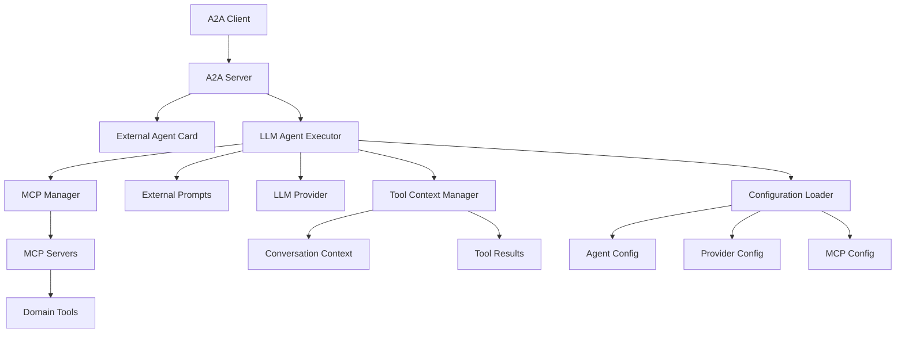

# A2A Agentic Server - Complete Documentation Wiki

Welcome to the comprehensive documentation for the A2A Agentic Server project. This wiki provides detailed technical and design documentation for building intelligent, domain-agnostic A2A (Agent-to-Agent) servers.

## 📖 Documentation Structure

### Core Architecture
- **[01-DESIGN-ARCHITECTURE.md](01-DESIGN-ARCHITECTURE.md)** - Overall system design and architectural principles
- **[02-SERVER-SETUP.md](02-SERVER-SETUP.md)** - A2A server implementation and setup
- **[03-AGENT-CARDS.md](03-AGENT-CARDS.md)** - External agent card configuration system

### LLM Integration
- **[04-LLM-PROVIDERS.md](04-LLM-PROVIDERS.md)** - LLM provider setup (Ollama, Gemini, Claude)
- **[05-LLM-AGENT-CORE.md](05-LLM-AGENT-CORE.md)** - Core LLM agent implementation
- **[06-LLM-AGENT-COGNITIVE.md](06-LLM-AGENT-COGNITIVE.md)** - Multi-turn cognitive processing system
- **[07-LLM-AGENT-TOOLS.md](07-LLM-AGENT-TOOLS.md)** - Tool calling and agentic behavior

### Tool Integration
- **[08-MCP-INTEGRATION.md](08-MCP-INTEGRATION.md)** - Model Context Protocol (MCP) integration
- **[09-TOOL-CONTEXT.md](09-TOOL-CONTEXT.md)** - Intelligent tool context management
- **[10-TOOL-AUTODETECTION.md](10-TOOL-AUTODETECTION.md)** - Automatic tool discovery and schema handling

### Configuration & Prompts
- **[11-CONFIGURATION.md](11-CONFIGURATION.md)** - Configuration system and external files
- **[12-PROMPT-SYSTEM.md](12-PROMPT-SYSTEM.md)** - External prompt management
- **[13-LOGGING.md](13-LOGGING.md)** - Structured logging and observability

### Examples & Tutorials
- **[14-GETTING-STARTED.md](14-GETTING-STARTED.md)** - Quick start guide
- **[15-BUILDING-CUSTOM-AGENTS.md](15-BUILDING-CUSTOM-AGENTS.md)** - Tutorial for custom domain agents
- **[16-EXAMPLES.md](16-EXAMPLES.md)** - Real-world examples and use cases

## 🎯 Project Goals

This project demonstrates how to build a **production-ready, domain-agnostic A2A server** with:

### ✅ Core Principles
- **Domain Agnostic**: No hardcoded domain-specific logic
- **Fail Fast**: Clear error messages instead of silent fallbacks
- **External Configuration**: All domain logic in configuration files
- **Tool Intelligence**: Smart tool chaining and parameter inference
- **Cognitive Processing**: Multi-turn reasoning for complex tasks

### ✅ Key Features
- **Multi-Provider LLM Support** - Ollama, Gemini, Claude
- **MCP Tool Integration** - Automatic tool discovery and calling
- **Intelligent Tool Context** - Parameter inference and chaining
- **External Agent Cards** - Configurable capabilities and skills
- **External Prompt System** - Maintainable prompt management
- **Structured Logging** - Full observability for debugging
- **Two-Phase Processing** - Tool execution + natural language synthesis

## 🏗️ Architecture Overview

## 🚀 Quick Navigation

### For Builders
1. Start with **[01-DESIGN-ARCHITECTURE.md](01-DESIGN-ARCHITECTURE.md)** to understand the overall design
2. Read **[05-LLM-AGENT-CORE.md](05-LLM-AGENT-CORE.md)** for the core implementation
3. Study **[09-TOOL-CONTEXT.md](09-TOOL-CONTEXT.md)** for intelligent tool management
4. Follow **[15-BUILDING-CUSTOM-AGENTS.md](15-BUILDING-CUSTOM-AGENTS.md)** to build your own

### For Users
1. Start with **[14-GETTING-STARTED.md](14-GETTING-STARTED.md)** for setup
2. Check **[16-EXAMPLES.md](16-EXAMPLES.md)** for usage examples
3. Refer to **[11-CONFIGURATION.md](11-CONFIGURATION.md)** for customization

### For Contributors
1. Read **[01-DESIGN-ARCHITECTURE.md](01-DESIGN-ARCHITECTURE.md)** for design principles
2. Study the LLM agent files (05-07) for core implementation
3. Check **[13-LOGGING.md](13-LOGGING.md)** for debugging techniques

## 🔍 What Makes This Special

This implementation goes beyond simple A2A protocol compliance to provide:

1. **True Agent Intelligence**: Multi-turn reasoning, tool chaining, context management
2. **Production Ready**: Structured logging, error handling, configuration management
3. **Extensible Design**: Domain-agnostic core with external configuration
4. **Developer Friendly**: Comprehensive documentation and clear architecture

The result is a foundation that can be adapted for any domain while maintaining reliability and intelligence.