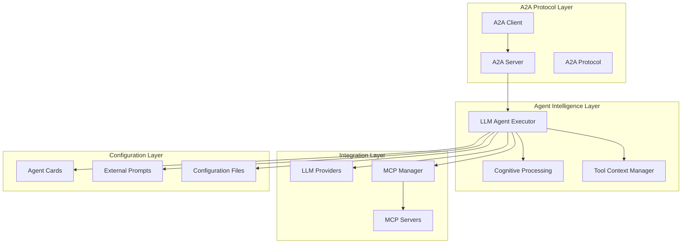
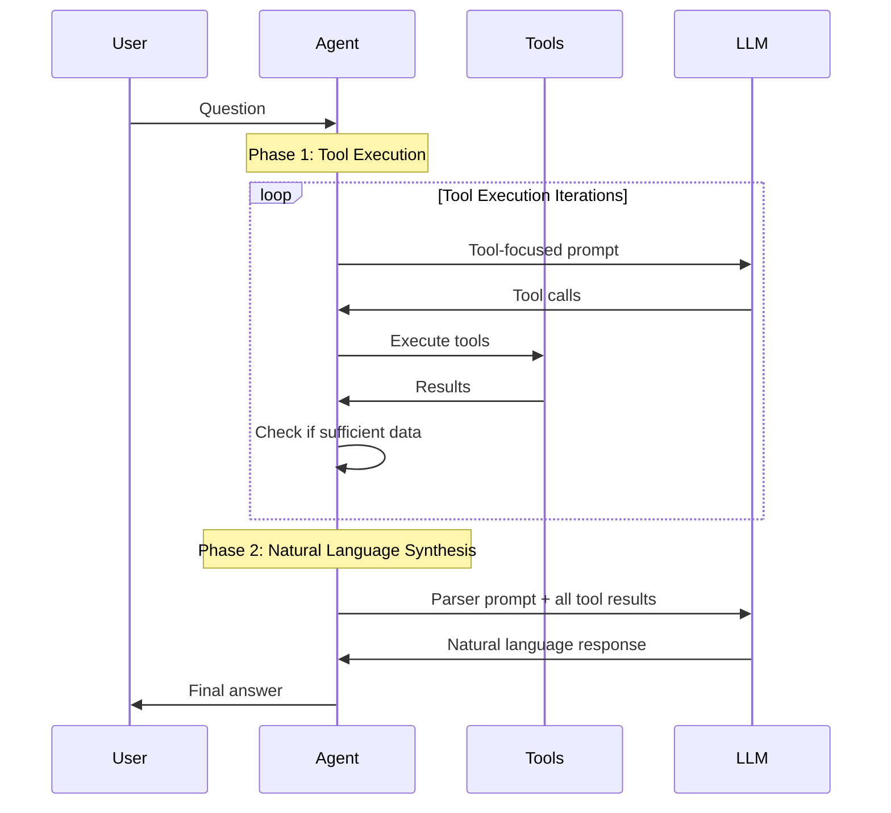
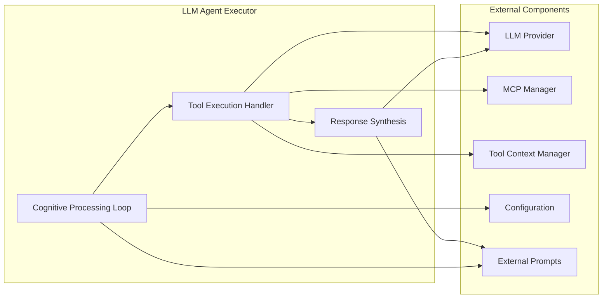

# Design Architecture

This document describes the overall design philosophy and architectural principles of the A2A Agentic Server.

## 🎯 Design Philosophy

### Core Principles

#### 1. Domain Agnostic Design
- **No hardcoded domain logic** in shared components
- **External configuration** for all domain-specific behavior
- **Generic interfaces** that work across different use cases
- **Fail fast** with clear error messages instead of domain-specific fallbacks

#### 2. Intelligent Agent Behavior
- **Multi-turn cognitive processing** for complex reasoning
- **Tool context management** for intelligent parameter inference
- **Conversation continuity** across multiple interactions
- **Agentic tool chaining** based on discovered capabilities

#### 3. Production-Ready Architecture
- **Structured logging** with full observability
- **Configuration-driven deployment** without code changes
- **Error handling** with clear diagnostic messages
- **Modular design** for easy testing and maintenance

## 🏗️ System Architecture

### High-Level Components



### Layer Responsibilities

#### A2A Protocol Layer
- **A2A Server**: HTTP/JSON-RPC endpoint implementing A2A specification
- **Agent Card**: Exposes capabilities and skills to clients
- **Request Handling**: Routes incoming requests to agent executor

#### Agent Intelligence Layer
- **LLM Agent Executor**: Core agent that orchestrates all operations
- **Cognitive Processing**: Multi-turn reasoning with tool execution and synthesis
- **Tool Context Manager**: Maintains conversation state and enables intelligent tool chaining

#### Integration Layer
- **LLM Providers**: Pluggable support for different LLM services
- **MCP Manager**: Manages connections to MCP servers
- **MCP Servers**: External tools accessed via Model Context Protocol

#### Configuration Layer
- **Agent Cards**: Define agent capabilities and skills externally
- **External Prompts**: Configurable prompts for different phases
- **Configuration Files**: YAML-based configuration management

## 🧠 Cognitive Architecture

### Two-Phase Processing System

The core innovation is a two-phase approach that separates tool execution from natural language generation:



#### Phase 1: Tool Execution
- **Purpose**: Efficiently gather data using available tools
- **Model Settings**: Low temperature (0.01) for reliable tool calling
- **Prompts**: Tool-focused, minimal natural language
- **Iterations**: Up to 3 iterations to gather sufficient data
- **Context**: Uses conversation history for intelligent parameter inference

#### Phase 2: Natural Language Synthesis  
- **Purpose**: Convert tool results into natural, helpful responses
- **Model Settings**: Higher temperature (0.1) for natural language
- **Prompts**: Parser prompts optimized for synthesis
- **Input**: All tool results from Phase 1
- **Output**: Domain-appropriate natural language response

### Benefits of Two-Phase Design

1. **Reliability**: Tool execution is separated from language generation
2. **Efficiency**: Multiple tool calls in Phase 1, single synthesis in Phase 2
3. **Quality**: Specialized prompts for each phase
4. **Debuggability**: Clear separation of concerns for troubleshooting

## 🔧 Component Interactions

### LLM Agent Executor
The central orchestrator that coordinates all components:



### Data Flow

1. **Request Processing**: A2A server receives request and routes to LLM agent
2. **Context Loading**: Agent loads conversation context and configuration
3. **Cognitive Processing**: Two-phase processing begins
4. **Tool Execution**: Agent discovers and calls appropriate tools
5. **Context Management**: Tool results are stored and analyzed
6. **Response Synthesis**: Natural language response is generated
7. **Response Delivery**: Final response sent back through A2A protocol

## 🛡️ Error Handling Strategy

### Fail Fast Philosophy
Instead of silent fallbacks, the system crashes with clear error messages:

```python
# Bad: Silent fallback
if not tool_schema:
    # Use hardcoded fallback parameters
    
# Good: Fail fast with clear message
if not tool_schema:
    raise RuntimeError(
        f"Tool {tool_name} is missing required inputSchema. "
        "This suggests the MCP server is not properly configured."
    )
```

### Error Categories

1. **Configuration Errors**: Missing or invalid configuration files
2. **Tool Schema Errors**: MCP servers with incomplete tool definitions
3. **Provider Errors**: LLM provider connection or API issues
4. **Context Errors**: Invalid conversation state or context

### Benefits

- **Early Detection**: Problems discovered at startup, not runtime
- **Clear Diagnostics**: Specific error messages guide troubleshooting
- **No Silent Failures**: Prevents incorrect behavior from proceeding
- **Maintainability**: Forces proper configuration and setup

## 🔄 Extensibility Points

### Adding New Domains
1. **Create MCP Server**: Implement domain-specific tools
2. **Create Agent Card**: Define capabilities and skills
3. **Create Prompts**: Optimize prompts for domain
4. **Create Configuration**: Set up MCP servers and providers

### Adding New LLM Providers
1. **Implement Provider Interface**: Extend base LLM provider
2. **Add Configuration Schema**: Define provider-specific config
3. **Update Factory**: Register new provider in factory
4. **Add Health Checks**: Implement provider health validation

### Adding New Tool Types
1. **Implement MCP Server**: Follow MCP protocol specification
2. **Define Tool Schemas**: Provide complete inputSchema
3. **Add to Configuration**: Configure MCP server connection
4. **Tool Context Rules**: Add any domain-specific context rules

## 📊 Performance Considerations

### Optimization Strategies

1. **Connection Pooling**: Reuse LLM provider connections
2. **Context Caching**: Cache conversation context for repeated queries
3. **Tool Result Reuse**: Avoid redundant tool calls within conversations
4. **Prompt Optimization**: Minimize token usage while maintaining quality

### Monitoring Points

1. **Tool Execution Time**: Track individual tool performance
2. **LLM Response Time**: Monitor provider response times
3. **Context Size**: Track conversation context growth
4. **Error Rates**: Monitor failure rates by component

This architecture provides a solid foundation for building intelligent, production-ready A2A agents that can be adapted to any domain while maintaining reliability and performance.