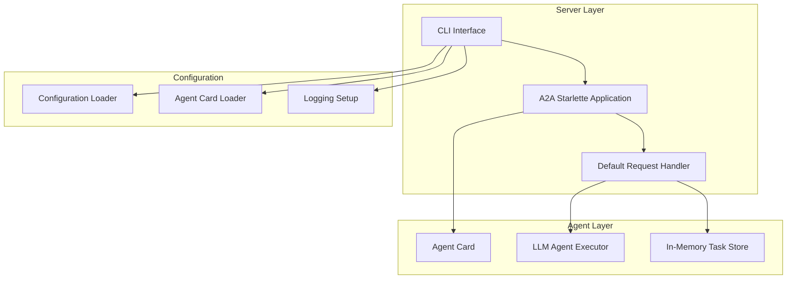
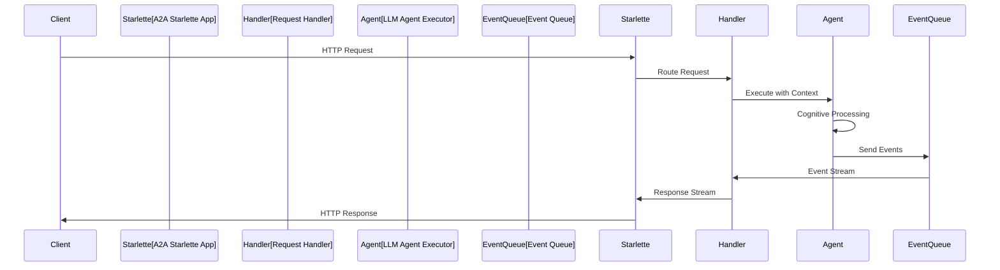

# A2A Server Setup

This document explains how the A2A server is implemented and configured, covering the main server setup, agent card system, and request handling.

## 🚀 Server Implementation Overview

The A2A server is implemented in `server/main.py` and provides a fully compliant A2A protocol endpoint with intelligent agent capabilities.

### Core Components



## 📝 Main Server Function

### Entry Point: `server/main.py`

The main server function implements a comprehensive CLI interface with multiple configuration options:

```python
@click.command()
@click.option("--host", default="localhost", help="Host to bind the server to")
@click.option("--port", default=8000, type=int, help="Port to bind the server to")
@click.option("--log-level", default="info", help="Logging level")
@click.option("--reload", is_flag=True, help="Enable auto-reload for development")
@click.option("--config", help="Path to configuration file")
@click.option("--log", default="file", help="Logging destination: console or file")
@click.option("--log-everything", is_flag=True, help="Enable detailed logging")
async def main(host, port, log_level, reload, config, log, log_everything):
```

### Server Startup Process

1. **Session ID Generation**: Creates unique session ID for logging
2. **Logging Configuration**: Sets up file-based or console logging
3. **Server Application Creation**: Builds the A2A server application
4. **Uvicorn Configuration**: Configures the ASGI server
5. **Server Launch**: Starts the server with specified settings

```python
# Generate session ID for this server instance
session_id = str(uuid.uuid4())[:8]

# Set up logging based on destination
if log == "file":
    setup_session_logging(session_id, log_level, actual_log_everything)
else:
    setup_logging(log_level)

# Create server application
server_app = create_server_app(host, port, config_path=config)
app = server_app.build()

# Start server
server = uvicorn.Server(uvicorn_config)
await server.serve()
```

## 🏗️ Server Application Factory

### `create_server_app()` Function

This function orchestrates the creation of all server components:

```python
def create_server_app(host: str, port: int, config_path: Optional[str] = None) -> A2AStarletteApplication:
    # Load configuration
    full_config = ConfigLoader.load_config(config_path)
    
    # Create agent card
    agent_card = create_agent_card(host, port, full_config)
    
    # Create LLM agent executor
    agent_executor = LLMAgentExecutor(full_config, config_path)
    
    # Create task store
    task_store = InMemoryTaskStore()
    
    # Create request handler
    request_handler = DefaultRequestHandler(
        agent_executor=agent_executor,
        task_store=task_store
    )
    
    # Create and return the server application
    server_app = A2AStarletteApplication(
        agent_card=agent_card,
        http_handler=request_handler
    )
    
    return server_app
```

### Component Initialization Order

1. **Configuration Loading**: Parse YAML config with environment variable substitution
2. **Agent Card Creation**: Load external agent card configuration
3. **LLM Agent Creation**: Initialize the core agent executor
4. **Task Store Creation**: Set up in-memory task management
5. **Request Handler Creation**: Wire agent executor to request handling
6. **Starlette App Creation**: Create the A2A-compliant web application

## 🎭 Agent Card System

### External Agent Card Configuration

The system uses external YAML files to define agent capabilities and skills, avoiding hardcoded agent definitions:

```python
def create_agent_card(host: str, port: int, config) -> AgentCard:
    """Create agent card for LLM-powered agent using external configuration."""
    # Load external agent card configuration if specified
    agent_card_config = None
    if config.agent.agent_card:
        agent_card_config = AgentCardLoader.load_agent_card_config(config.agent.agent_card)
        if agent_card_config is None:
            raise RuntimeError(
                f"Failed to load agent card configuration from '{config.agent.agent_card}'. "
                "Please check that the file exists and is properly formatted. "
                "Agent card configuration is required for proper server operation."
            )
    
    # Use the agent card loader to create the card
    return AgentCardLoader.create_agent_card_from_config(host, port, config, agent_card_config)
```

### Agent Card Structure

Agent cards are created from external YAML files with the following structure:

```yaml
# agent_cards/scientific_data_analysis.yaml
agent_card:
  default_input_modes:
    - "text"
  default_output_modes:
    - "text"
  
  capabilities:
    streaming: true
    push_notifications: false
  
  skills:
    - id: "scientific_data_analysis"
      name: "Scientific Data Analysis"
      description: "Analyze scientific datasets and provide insights"
      tags: ["science", "data", "analysis"]
      examples:
        - "Analyze this simulation data"
        - "What variables are in this dataset?"
```

### Fail-Fast Agent Card Loading

The system enforces external configuration by failing fast when agent cards are missing:

```python
# In AgentCardLoader.create_agent_card_from_config()
else:
    # No fallback - crash with clear error message
    logger.error("No external agent card configuration provided and no fallback available")
    raise RuntimeError(
        "Agent card configuration is required but not provided. "
        "Please specify 'agent_card' in your configuration file pointing to a valid agent card YAML file. "
        "This ensures the agent's capabilities and skills are properly defined for your specific use case."
    )
```

## 🔧 Request Handling

### DefaultRequestHandler Integration

The server uses the A2A SDK's `DefaultRequestHandler` which delegates to our LLM agent:

```python
request_handler = DefaultRequestHandler(
    agent_executor=agent_executor,
    task_store=task_store
)
```

### Request Flow

1. **HTTP Request**: Client sends A2A protocol request
2. **Starlette Routing**: Request routed to appropriate handler
3. **Request Context**: A2A SDK creates RequestContext
4. **Agent Execution**: LLMAgentExecutor processes the request
5. **Event Queue**: Results sent back through A2A event system
6. **HTTP Response**: Final response delivered to client



## ⚙️ Configuration Integration

### Configuration File Structure

The server loads configuration from YAML files with environment variable substitution:

```yaml
# config_data1_agent.yaml
default_provider: "ollama"

agent:
  name: "Data1.bp File Agent"
  description: "Specialized agent for analyzing data"
  version: "1.0.0"
  agent_card: "agent_cards/scientific_data_analysis.yaml"
  prompts:
    tool_execution: "personas/adios/adios2_tool_execution.md"
    parser_synthesis: "personas/adios/adios2_parser_synthesis.md"

providers:
  ollama:
    base_url: "http://localhost:11434"
    model: "llama3.2:1b"
    max_tokens: 4096
    temperature: 0.05

mcp_servers:
  adios2:
    name: "adios2"
    command: ["uv", "--directory", "adios", "run", "adios-mcp"]
    cwd: "."
    enabled: true

server:
  host: "localhost"
  port: 8000
  log_level: "info"
  streaming: true
```

### Environment Variable Substitution

The configuration system supports environment variables:

```yaml
providers:
  gemini:
    api_key: "${GEMINI_API_KEY}"
    model: "${GEMINI_MODEL:gemini-pro}"
```

## 📊 Logging Configuration

### Session-Based Logging

The server implements comprehensive session-based logging:

```python
def setup_session_logging(session_id: str, level: str = "info", log_everything: bool = True):
    # Create logs directory
    logs_dir = Path("logs")
    logs_dir.mkdir(exist_ok=True)
    
    # Create session log file
    log_file = logs_dir / f"session_{session_id}.log"
    
    # Configure detailed logging for troubleshooting
    if log_everything:
        # Detailed formatter for file logging
        formatter = logging.Formatter(
            "%(asctime)s - %(name)s - %(levelname)s - %(message)s",
            datefmt="%Y-%m-%d %H:%M:%S"
        )
```

### Logging Modes

1. **File Mode** (Default): Detailed logging to session files
2. **Console Mode**: Basic logging to terminal
3. **Log Everything**: Includes prompts, tool calls, and full content
4. **Standard Mode**: Basic operations only

## 🚀 Development vs Production

### Development Mode

```bash
# Development with auto-reload
uv run python -m server.main --config config.yaml --reload --log console

# Debug mode with detailed logging
uv run python -m server.main --config config.yaml --log-level debug --log-everything
```

### Production Mode

```bash
# Production with file logging
uv run python -m server.main --config config.yaml --host 0.0.0.0 --port 8000

# Production with specific configuration
uv run python -m server.main --config production_config.yaml --log-level warning
```

## 🔍 Health Checks and Monitoring

### Startup Validation

The server validates configuration and dependencies during startup:

1. **Configuration Validation**: Checks for required fields and valid values
2. **Agent Card Loading**: Ensures external agent card files exist and are valid
3. **LLM Provider Health**: Tests LLM provider connectivity
4. **MCP Server Initialization**: Attempts to connect to configured MCP servers

### Runtime Monitoring

- **Agent Card Endpoint**: `/.well-known/agent.json` for capability discovery
- **Health Status**: Provider status and MCP server connectivity
- **Structured Logging**: Full observability for debugging and monitoring

### Error Handling

The server implements comprehensive error handling:

```python
try:
    server_app = create_server_app(host, port, config_path=config)
    app = server_app.build()
    
    logger.info(f"Starting A2A CLI server on {host}:{port}")
    logger.info(f"Agent card available at: http://{host}:{port}/.well-known/agent.json")
    
    server = uvicorn.Server(uvicorn_config)
    await server.serve()
    
except Exception as e:
    logger.error(f"Failed to start server: {e}")
    raise click.ClickException(f"Server startup failed: {e}")
```

This server implementation provides a robust, configurable foundation for A2A agents with comprehensive error handling, logging, and monitoring capabilities.