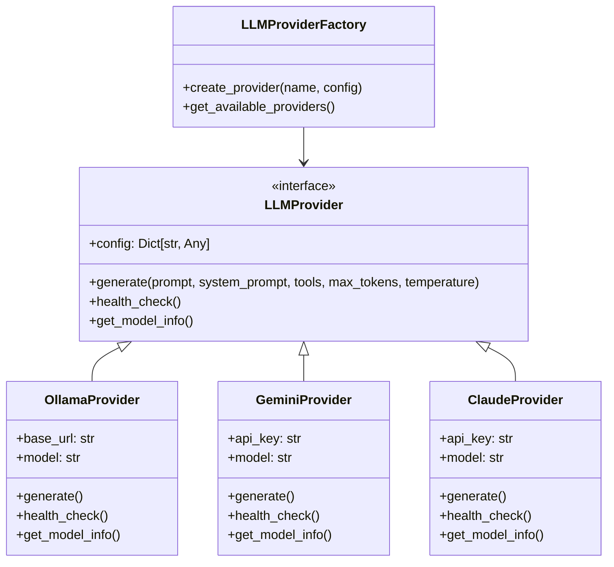

# LLM Providers Implementation

This document covers the LLM provider system, with detailed focus on Ollama setup, provider configuration, health checking, and tool use integration.

## 🏗️ LLM Provider Architecture

The LLM provider system supports multiple providers with a unified interface, health checking, and automatic failover capabilities.

### Provider Interface



## 🦙 Ollama Provider Implementation

### Ollama Setup and Configuration

Ollama is the primary provider for local model execution with optimized settings for tool calling:

#### Installation and Setup

```bash
# Install Ollama
curl -fsSL https://ollama.ai/install.sh | sh

# Start Ollama service
ollama serve

# Pull the optimized model for tool calling
ollama pull llama3.2:1b

# Verify installation
ollama list
```

#### Ollama Provider Configuration

```yaml
providers:
  ollama:
    base_url: "http://localhost:11434"
    model: "llama3.2:1b"
    max_tokens: 4096
    temperature: 0.05  # Very low for structured cognitive processing
    timeout: 600  # Extended timeout for complex reasoning
```

### Ollama Provider Implementation

The Ollama provider is implemented in `shared/llm/ollama_provider.py`:

```python
class OllamaProvider(LLMProvider):
    """Ollama LLM provider implementation."""
    
    def __init__(self, config: Dict[str, Any]):
        self.config = config
        self.base_url = config.get('base_url', 'http://localhost:11434')
        self.model = config.get('model', 'llama3.2:1b')
        self.timeout = config.get('timeout', 60)
        
    async def generate(
        self, 
        prompt: str, 
        system_prompt: Optional[str] = None,
        tools: Optional[List[Dict[str, Any]]] = None,
        max_tokens: Optional[int] = None,
        temperature: Optional[float] = None
    ) -> LLMResponse:
        """Generate response using Ollama."""
        
        # Build request payload
        request_data = {
            "model": self.model,
            "prompt": prompt,
            "system": system_prompt,
            "stream": False,
            "options": {
                "num_predict": max_tokens or self.config.get('max_tokens', 2048),
                "temperature": temperature or self.config.get('temperature', 0.7),
            }
        }
        
        # Add tools if provided (Ollama function calling)
        if tools:
            request_data["tools"] = tools
        
        try:
            async with httpx.AsyncClient(timeout=self.timeout) as client:
                response = await client.post(
                    f"{self.base_url}/api/generate",
                    json=request_data
                )
                response.raise_for_status()
                
                result = response.json()
                
                # Extract tool calls if present
                tool_calls = []
                if "tool_calls" in result:
                    tool_calls = result["tool_calls"]
                
                return LLMResponse(
                    text=result.get("response", ""),
                    metadata={
                        "model": self.model,
                        "tool_calls": tool_calls,
                        "usage": result.get("usage", {}),
                        "done": result.get("done", False)
                    }
                )
                
        except Exception as e:
            raise LLMError(f"Ollama generation failed: {e}", "ollama")
    
    async def health_check(self) -> bool:
        """Check if Ollama service is healthy."""
        try:
            async with httpx.AsyncClient(timeout=10) as client:
                response = await client.get(f"{self.base_url}/api/tags")
                return response.status_code == 200
        except Exception:
            return False
    
    def get_model_info(self) -> Dict[str, Any]:
        """Get information about the current model."""
        return {
            "provider": "ollama",
            "model": self.model,
            "base_url": self.base_url,
            "supports_tools": True,
            "supports_streaming": True
        }
```

### Ollama Tool Calling Integration

Ollama supports native function calling, which the system leverages:

#### Tool Schema Conversion

The system converts MCP tool schemas to Ollama's function calling format:

```python
def _get_ollama_tools_schema(self) -> List[Dict[str, Any]]:
    """Convert MCP tools to Ollama tools schema."""
    ollama_tools = []
    
    for tool_name, client in self.mcp_manager.clients.items():
        for mcp_tool_name, tool_schema in client.tools.items():
            # Convert MCP tool schema to Ollama format
            ollama_tool = {
                "type": "function",
                "function": {
                    "name": mcp_tool_name,
                    "description": tool_schema.get("description", ""),
                    "parameters": {
                        "type": "object",
                        "properties": {},
                        "required": []
                    }
                }
            }
            
            # Use actual MCP tool input schema if available
            if "inputSchema" in tool_schema:
                input_schema = tool_schema["inputSchema"]
                if "properties" in input_schema:
                    ollama_tool["function"]["parameters"]["properties"] = input_schema["properties"]
                if "required" in input_schema:
                    ollama_tool["function"]["parameters"]["required"] = input_schema["required"]
            else:
                # Fail fast instead of using fallbacks
                raise RuntimeError(f"Tool {mcp_tool_name} is missing required inputSchema.")
            
            ollama_tools.append(ollama_tool)
    
    return ollama_tools
```

#### Tool Call Handling

Ollama returns tool calls in its response metadata:

```python
async def _handle_ollama_tool_calls(self, llm_response: LLMResponse) -> str:
    """Handle native Ollama tool calls."""
    response_text = llm_response.text
    tool_calls = llm_response.metadata.get("tool_calls", [])
    
    if not tool_calls:
        return response_text
    
    logger.info(f"Processing {len(tool_calls)} tool calls from Ollama")
    
    # Execute each tool call
    tool_results = []
    for tool_call in tool_calls:
        try:
            function = tool_call.get("function", {})
            tool_name = function.get("name")
            arguments = function.get("arguments", {})
            
            if tool_name:
                result = await self.mcp_manager.call_tool(tool_name, arguments)
                
                # Format the result
                if 'content' in result:
                    for content_item in result['content']:
                        if 'text' in content_item:
                            tool_results.append(f"\\n**{tool_name} result:**\\n{content_item['text']}")
                else:
                    tool_results.append(f"\\n**{tool_name} result:**\\n{result}")
                    
        except Exception as e:
            logger.error(f"Error executing tool call: {e}")
            tool_results.append(f"\\n**Error with {tool_name}:**\\n{str(e)}")
    
    # Combine response with tool results
    if tool_results:
        return response_text + "\\n" + "\\n".join(tool_results)
    else:
        return response_text
```

## 🤖 Other Provider Implementations

### Gemini Provider

The Gemini provider integrates with Google's AI models:

```python
class GeminiProvider(LLMProvider):
    """Google Gemini LLM provider implementation."""
    
    def __init__(self, config: Dict[str, Any]):
        self.config = config
        self.api_key = config.get('api_key') or os.getenv('GEMINI_API_KEY')
        self.model = config.get('model', 'gemini-pro')
        
        if not self.api_key:
            raise LLMError("Gemini API key not provided", "gemini")
        
        genai.configure(api_key=self.api_key)
        self.client = genai.GenerativeModel(self.model)
    
    async def generate(self, prompt: str, system_prompt: Optional[str] = None, **kwargs) -> LLMResponse:
        """Generate response using Gemini."""
        try:
            # Combine system prompt and user prompt
            full_prompt = f"{system_prompt}\\n\\n{prompt}" if system_prompt else prompt
            
            response = await self.client.generate_content_async(
                full_prompt,
                generation_config=genai.types.GenerationConfig(
                    max_output_tokens=kwargs.get('max_tokens', self.config.get('max_tokens', 2048)),
                    temperature=kwargs.get('temperature', self.config.get('temperature', 0.7)),
                )
            )
            
            return LLMResponse(
                text=response.text,
                metadata={
                    "model": self.model,
                    "usage": {
                        "prompt_tokens": response.usage_metadata.prompt_token_count,
                        "completion_tokens": response.usage_metadata.candidates_token_count,
                        "total_tokens": response.usage_metadata.total_token_count
                    }
                }
            )
            
        except Exception as e:
            raise LLMError(f"Gemini generation failed: {e}", "gemini")
    
    async def health_check(self) -> bool:
        """Check if Gemini API is accessible."""
        try:
            # Try a simple generation to test connectivity
            response = await self.client.generate_content_async("Hello")
            return bool(response.text)
        except Exception:
            return False
```

### Claude Provider

The Claude provider integrates with Anthropic's models:

```python
class ClaudeProvider(LLMProvider):
    """Anthropic Claude LLM provider implementation."""
    
    def __init__(self, config: Dict[str, Any]):
        self.config = config
        self.api_key = config.get('api_key') or os.getenv('ANTHROPIC_API_KEY')
        self.model = config.get('model', 'claude-3-sonnet-20240229')
        
        if not self.api_key:
            raise LLMError("Claude API key not provided", "claude")
        
        self.client = anthropic.AsyncAnthropic(api_key=self.api_key)
    
    async def generate(self, prompt: str, system_prompt: Optional[str] = None, **kwargs) -> LLMResponse:
        """Generate response using Claude."""
        try:
            messages = [{"role": "user", "content": prompt}]
            
            response = await self.client.messages.create(
                model=self.model,
                max_tokens=kwargs.get('max_tokens', self.config.get('max_tokens', 2048)),
                temperature=kwargs.get('temperature', self.config.get('temperature', 0.7)),
                system=system_prompt,
                messages=messages
            )
            
            return LLMResponse(
                text=response.content[0].text,
                metadata={
                    "model": self.model,
                    "usage": {
                        "prompt_tokens": response.usage.input_tokens,
                        "completion_tokens": response.usage.output_tokens,
                        "total_tokens": response.usage.input_tokens + response.usage.output_tokens
                    }
                }
            )
            
        except Exception as e:
            raise LLMError(f"Claude generation failed: {e}", "claude")
```

## 🏭 Provider Factory System

### LLMProviderFactory Implementation

The factory pattern manages provider creation and registration:

```python
class LLMProviderFactory:
    """Factory for creating LLM providers."""
    
    _providers = {
        'ollama': OllamaProvider,
        'gemini': GeminiProvider,
        'claude': ClaudeProvider,
        'openai': OpenAIProvider
    }
    
    @classmethod
    def create_provider(cls, provider_name: str, config: Dict[str, Any]) -> LLMProvider:
        """Create an LLM provider instance."""
        if provider_name not in cls._providers:
            available = list(cls._providers.keys())
            raise LLMError(f"Unknown provider '{provider_name}'. Available: {available}", provider_name)
        
        provider_class = cls._providers[provider_name]
        return provider_class(config)
    
    @classmethod
    def get_available_providers(cls) -> List[str]:
        """Get list of available provider names."""
        return list(cls._providers.keys())
    
    @classmethod
    def register_provider(cls, name: str, provider_class: type):
        """Register a new provider class."""
        cls._providers[name] = provider_class
```

## 🔄 Provider Health Checking and Failover

### Health Monitoring

The LLM agent continuously monitors provider health:

```python
async def _ensure_provider(self) -> LLMProvider:
    """Ensure LLM provider is initialized and healthy."""
    if self.provider is None:
        await self._initialize_provider()
    
    # Check provider health periodically
    if not await self.provider.health_check():
        logger.warning(f"Provider {self.provider_name} health check failed, reinitializing...")
        await self._initialize_provider()
    
    return self.provider
```

### Automatic Failover

When a provider fails, the system automatically tries fallback providers:

```python
async def _try_fallback_providers(self) -> None:
    """Try fallback providers if the primary one fails."""
    available_providers = [name for name in self.config.providers.keys() if name != self.provider_name]
    
    for fallback_provider in available_providers:
        try:
            logger.info(f"Trying fallback provider: {fallback_provider}")
            provider_config = ConfigLoader.get_provider_config(self.config, fallback_provider)
            fallback = LLMProviderFactory.create_provider(fallback_provider, provider_config)
            
            if await fallback.health_check():
                self.provider = fallback
                self.provider_name = fallback_provider
                logger.info(f"Successfully switched to fallback provider: {fallback_provider}")
                return
                
        except Exception as e:
            logger.warning(f"Fallback provider {fallback_provider} also failed: {e}")
    
    # If all providers fail, raise an error
    raise LLMError("All configured LLM providers failed", "all")
```

## ⚙️ Provider Configuration

### Configuration Schema

Each provider has its own configuration schema:

```yaml
providers:
  ollama:
    base_url: "http://localhost:11434"
    model: "llama3.2:1b"
    max_tokens: 4096
    temperature: 0.05
    timeout: 600
    
  gemini:
    api_key: "${GEMINI_API_KEY}"
    model: "gemini-pro"
    max_tokens: 2048
    temperature: 0.7
    
  claude:
    api_key: "${ANTHROPIC_API_KEY}"
    model: "claude-3-sonnet-20240229"
    max_tokens: 2048
    temperature: 0.7
    
  openai:
    api_key: "${OPENAI_API_KEY}"
    model: "gpt-4"
    max_tokens: 2048
    temperature: 0.7
```

### Environment Variable Support

Sensitive information like API keys can be provided via environment variables:

```python
# In provider initialization
self.api_key = config.get('api_key') or os.getenv('GEMINI_API_KEY')

if not self.api_key:
    raise LLMError("Gemini API key not provided", "gemini")
```

### Configuration Validation

The configuration loader validates provider configurations:

```python
@staticmethod
def validate_config(config: A2AConfig) -> List[str]:
    """Validate configuration and return any errors."""
    errors = []
    
    # Validate default provider exists
    if config.default_provider not in config.providers:
        errors.append(f"Default provider '{config.default_provider}' not configured")
    
    # Validate each provider configuration
    for provider_name, provider_config in config.providers.items():
        if provider_name == "ollama":
            if not provider_config.base_url:
                errors.append(f"Ollama provider missing base_url")
        elif provider_name in ["gemini", "claude", "openai"]:
            if not provider_config.api_key and not os.getenv(f"{provider_name.upper()}_API_KEY"):
                errors.append(f"{provider_name} provider missing api_key")
    
    return errors
```

## 🎯 Tool Use Optimization

### Model Selection for Tool Calling

Different models are optimized for different tasks:

#### Ollama Models for Tool Calling

```yaml
# Optimized for reliable tool calling
model: "llama3.2:1b"
temperature: 0.01  # Very low for consistent tool execution

# Alternative models
# model: "llama3.2:3b"  # Better reasoning, slower
# model: "codestral:7b"  # Good for code-related tools
```

#### Temperature Settings by Phase

The system uses different temperature settings for different phases:

```python
# Phase 1: Tool Execution - Very low temperature for reliability
llm_response = await provider.generate(
    prompt=current_prompt,
    system_prompt=tool_focused_prompt,
    tools=ollama_tools,
    max_tokens=1024,  # Reduced for tool calls
    temperature=0.01  # Very low for reliable tool execution
)

# Phase 2: Natural Language Synthesis - Higher temperature for fluency
synthesis_response = await provider.generate(
    prompt=parser_prompt,
    system_prompt=synthesis_system_prompt,
    max_tokens=1024,
    temperature=0.1  # Lower temperature for factual, precise responses
)
```

## 📊 Performance Monitoring

### Provider Status Monitoring

The system provides comprehensive provider status information:

```python
async def get_provider_status(self) -> Dict[str, Any]:
    """Get current provider status for debugging."""
    status = {
        "current_provider": self.provider_name,
        "provider_healthy": False,
        "available_providers": list(self.config.providers.keys()),
        "config_errors": ConfigLoader.validate_config(self.config)
    }
    
    if self.provider:
        try:
            status["provider_healthy"] = await self.provider.health_check()
            status["model_info"] = self.provider.get_model_info()
        except Exception as e:
            status["provider_error"] = str(e)
    
    return status
```

### Usage Tracking

Providers return usage metadata for monitoring:

```python
return LLMResponse(
    text=response.text,
    metadata={
        "model": self.model,
        "usage": {
            "prompt_tokens": response.usage_metadata.prompt_token_count,
            "completion_tokens": response.usage_metadata.candidates_token_count,
            "total_tokens": response.usage_metadata.total_token_count
        }
    }
)
```

## 🎉 Benefits of Multi-Provider Architecture

### Reliability Benefits

1. **Automatic Failover**: Seamless switching between providers
2. **Health Monitoring**: Continuous provider health checking
3. **Error Isolation**: Provider failures don't crash the system
4. **Graceful Degradation**: System continues operating with available providers

### Flexibility Benefits

1. **Provider Choice**: Support for local and cloud providers
2. **Model Optimization**: Different models for different tasks
3. **Cost Control**: Mix of free local and paid cloud providers
4. **Performance Tuning**: Provider-specific optimizations

### Development Benefits

1. **Easy Testing**: Switch providers for testing different capabilities
2. **Provider Comparison**: A/B testing between different models
3. **Development Workflow**: Use local models for development, cloud for production
4. **Extensibility**: Easy to add new providers

This multi-provider system provides a robust foundation for LLM integration with intelligent failover, health monitoring, and optimization for different use cases.