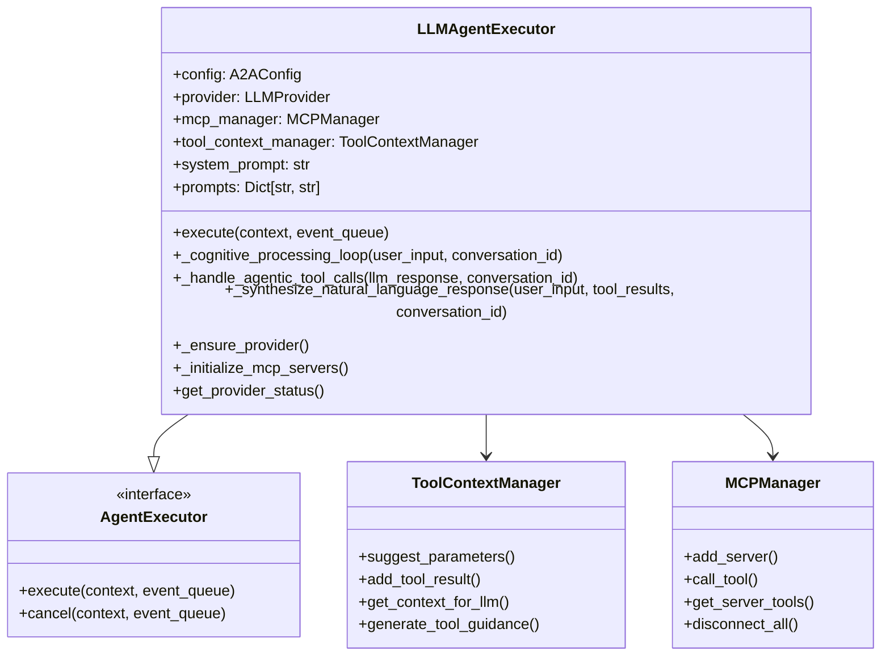
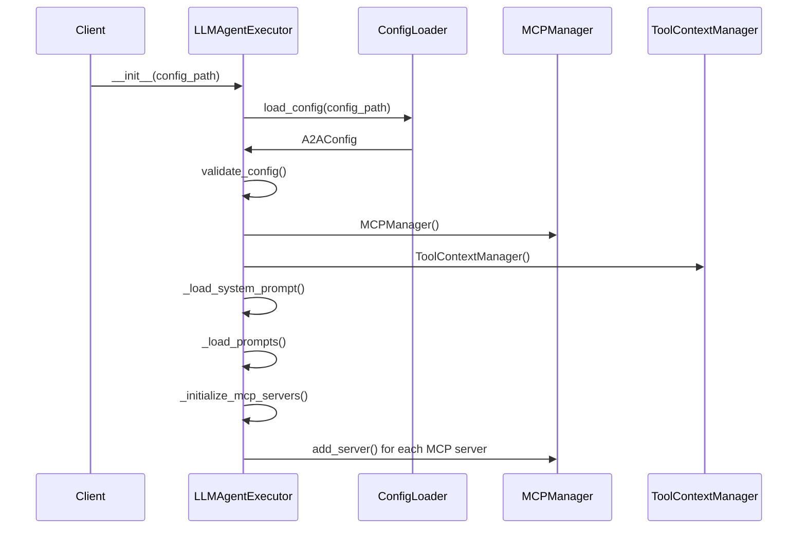

# LLM Agent Core Implementation

This document provides a comprehensive deep-dive into the `LLMAgentExecutor` class, which is the heart of the agentic system. This is the most important component that orchestrates all agent behavior.

## 🧠 LLMAgentExecutor Overview

The `LLMAgentExecutor` is the central orchestrator that implements intelligent agent behavior with multi-turn reasoning, tool calling, and context management. Located in `shared/core/llm_agent.py`, it extends the A2A SDK's `AgentExecutor` interface.

### Class Architecture



## 🏗️ Initialization Process

### Constructor Responsibilities

The constructor sets up all components needed for intelligent agent behavior:

```python
def __init__(self, config: Optional[A2AConfig] = None, config_path: Optional[str] = None) -> None:
    # Load and validate configuration
    self.config = config or ConfigLoader.load_config(config_path)
    config_errors = ConfigLoader.validate_config(self.config)
    if config_errors:
        logger.warning(f"Configuration issues: {config_errors}")
    
    # Initialize core components
    self.provider: Optional[LLMProvider] = None
    self.provider_name = self.config.default_provider
    self.mcp_manager = MCPManager()
    self.tool_context_manager = ToolContextManager()
    
    # Load agent configuration
    self.name = self.config.agent.name
    self.system_prompt = self._load_system_prompt()
    self.prompts = self._load_prompts()
    
    # Initialize logging settings
    self.log_everything = should_log_everything()
    self.structured_logger = StructuredLogger(__name__)
    
    # Initialize MCP servers asynchronously
    asyncio.create_task(self._initialize_mcp_servers())
```

### Initialization Flow



## ⚙️ Configuration Loading

### System Prompt Loading

The agent loads system prompts with a domain-agnostic fallback:

```python
def _load_system_prompt(self) -> str:
    """Load system prompt from config."""
    # Use system_prompt from config if available
    if self.config.agent.system_prompt:
        return self.config.agent.system_prompt
    
    # Ultimate fallback - keep domain-agnostic
    return "You are a helpful AI assistant for scientific data analysis."
```

### External Prompt Loading

External prompts are loaded for different processing phases:

```python
def _load_prompts(self) -> Dict[str, str]:
    """Load external prompt files if configured."""
    if not self.config.agent.prompts:
        logger.info("No external prompts configured")
        return {}
    
    try:
        prompts = PromptLoader.load_prompts(self.config.agent.prompts)
        logger.info(f"Loaded {len(prompts)} external prompts: {list(prompts.keys())}")
        return prompts
    except Exception as e:
        logger.warning(f"Failed to load external prompts: {e}")
        return {}
```

## 🔗 LLM Provider Management

### Provider Initialization

The agent manages LLM provider connections with health checking and fallback support:

```python
async def _ensure_provider(self) -> LLMProvider:
    """Ensure LLM provider is initialized and healthy."""
    if self.provider is None:
        await self._initialize_provider()
    
    # Check provider health periodically
    if not await self.provider.health_check():
        logger.warning(f"Provider {self.provider_name} health check failed, reinitializing...")
        await self._initialize_provider()
    
    return self.provider
```

### Provider Fallback System

If the primary provider fails, the system tries fallback providers:

```python
async def _try_fallback_providers(self) -> None:
    """Try fallback providers if the primary one fails."""
    available_providers = [name for name in self.config.providers.keys() if name != self.provider_name]
    
    for fallback_provider in available_providers:
        try:
            logger.info(f"Trying fallback provider: {fallback_provider}")
            provider_config = ConfigLoader.get_provider_config(self.config, fallback_provider)
            fallback = LLMProviderFactory.create_provider(fallback_provider, provider_config)
            
            if await fallback.health_check():
                self.provider = fallback
                self.provider_name = fallback_provider
                logger.info(f"Successfully switched to fallback provider: {fallback_provider}")
                return
                
        except Exception as e:
            logger.warning(f"Fallback provider {fallback_provider} also failed: {e}")
    
    # If all providers fail, raise an error
    raise LLMError("All configured LLM providers failed", "all")
```

## 🛠️ MCP Server Integration

### Asynchronous MCP Initialization

MCP servers are initialized asynchronously during agent startup:

```python
async def _initialize_mcp_servers(self) -> None:
    """Initialize MCP servers from configuration."""
    if not self.config.mcp_servers:
        logger.info("No MCP servers configured")
        return
    
    logger.info(f"Initializing {len(self.config.mcp_servers)} MCP servers...")
    
    for server_name, server_config in self.config.mcp_servers.items():
        if not server_config.enabled:
            logger.info(f"Skipping disabled MCP server: {server_name}")
            continue
        
        try:
            success = await self.mcp_manager.add_server(
                server_name, 
                server_config.command, 
                server_config.cwd
            )
            
            if success:
                tools = self.mcp_manager.get_server_tools(server_name)
                logger.info(f"✅ MCP server '{server_name}' connected with {len(tools)} tools")
            else:
                logger.error(f"❌ Failed to connect to MCP server '{server_name}'")
                
        except Exception as e:
            logger.error(f"Error initializing MCP server '{server_name}': {e}")
```

### Tool Schema Conversion

The agent converts MCP tool schemas to formats compatible with different LLM providers:

```python
def _get_ollama_tools_schema(self) -> List[Dict[str, Any]]:
    """Convert MCP tools to Ollama tools schema."""
    ollama_tools = []
    
    for tool_name, client in self.mcp_manager.clients.items():
        for mcp_tool_name, tool_schema in client.tools.items():
            # Convert MCP tool schema to Ollama format
            ollama_tool = {
                "type": "function",
                "function": {
                    "name": mcp_tool_name,
                    "description": tool_schema.get("description", ""),
                    "parameters": {
                        "type": "object",
                        "properties": {},
                        "required": []
                    }
                }
            }
            
            # Use actual MCP tool input schema if available
            if "inputSchema" in tool_schema:
                input_schema = tool_schema["inputSchema"]
                if "properties" in input_schema:
                    ollama_tool["function"]["parameters"]["properties"] = input_schema["properties"]
                if "required" in input_schema:
                    ollama_tool["function"]["parameters"]["required"] = input_schema["required"]
            else:
                # No inputSchema available - fail fast instead of using fallbacks
                logger.error(f"Tool {mcp_tool_name} has no inputSchema - MCP server may be misconfigured")
                raise RuntimeError(f"Tool {mcp_tool_name} is missing required inputSchema.")
            
            ollama_tools.append(ollama_tool)
    
    return ollama_tools
```

## 🎯 Main Execution Flow

### Request Processing Entry Point

The main execution method implements the A2A AgentExecutor interface:

```python
async def execute(self, context: RequestContext, event_queue: EventQueue) -> None:
    """
    Execute the agent logic with enhanced cognitive processing and multi-turn reasoning.
    """
    try:
        # Get user input and create conversation context
        user_input = context.get_user_input()
        conversation_id = context.context_id or str(uuid.uuid4())
        
        # Log user query with structured logging if enabled
        if self.log_everything:
            self.structured_logger.log_user_query(user_input, conversation_id)
        
        # Multi-turn cognitive processing loop
        final_response = await self._cognitive_processing_loop(user_input, conversation_id)
        
        # Send final synthesized response
        await event_queue.enqueue_event(new_agent_text_message(final_response))
        
    except LLMError as e:
        # Handle LLM-specific errors with helpful guidance
        error_message = f"I encountered an issue with the {e.provider} provider: {str(e)}"
        
        if "api_key" in str(e).lower():
            error_message += "\\n\\nPlease check your API key configuration."
        elif "connection" in str(e).lower():
            error_message += "\\n\\nPlease check your network connection and provider settings."
        
        await event_queue.enqueue_event(new_agent_text_message(error_message))
        
    except Exception as e:
        # Handle unexpected errors
        logger.error(f"Unexpected error in LLM agent: {e}")
        error_message = f"I encountered an unexpected error: {str(e)}"
        await event_queue.enqueue_event(new_agent_text_message(error_message))
```

### Error Handling Strategy

The agent implements comprehensive error handling with specific error types:

1. **LLMError**: Provider-specific errors with helpful guidance
2. **Configuration Errors**: Invalid or missing configuration
3. **MCP Errors**: Tool server connection or execution issues
4. **General Exceptions**: Unexpected errors with full logging

## 🔍 Health Monitoring

### Provider Status Checking

The agent provides comprehensive status information for debugging:

```python
async def get_provider_status(self) -> Dict[str, Any]:
    """Get current provider status for debugging."""
    status = {
        "current_provider": self.provider_name,
        "provider_healthy": False,
        "available_providers": list(self.config.providers.keys()),
        "config_errors": ConfigLoader.validate_config(self.config)
    }
    
    if self.provider:
        try:
            status["provider_healthy"] = await self.provider.health_check()
            status["model_info"] = self.provider.get_model_info()
        except Exception as e:
            status["provider_error"] = str(e)
    
    return status
```

## 🧹 Cleanup and Cancellation

### Graceful Shutdown

The agent implements proper cleanup for graceful shutdowns:

```python
async def cancel(self, context: RequestContext, event_queue: EventQueue) -> None:
    """Handle task cancellation."""
    logger.info("LLM task cancellation requested")
    
    # Cleanup MCP connections
    try:
        await self.mcp_manager.disconnect_all()
    except Exception as e:
        logger.error(f"Error disconnecting MCP servers during cancellation: {e}")
    
    await event_queue.enqueue_event(
        new_agent_text_message("Task has been cancelled.")
    )
```

## 🔧 Configuration Validation

### Runtime Configuration Checking

The agent validates configuration and provides detailed error messages:

```python
# Validate configuration during initialization
config_errors = ConfigLoader.validate_config(self.config)
if config_errors:
    logger.warning(f"Configuration issues: {config_errors}")

# Fail fast on missing external configurations
if not agent_card_config:
    raise RuntimeError(
        "Agent card configuration is required but not provided. "
        "Please specify 'agent_card' in your configuration file."
    )
```

This core implementation provides the foundation for intelligent agent behavior, with robust error handling, configuration management, and integration with external systems. The next documents will cover the cognitive processing system and tool handling in detail.