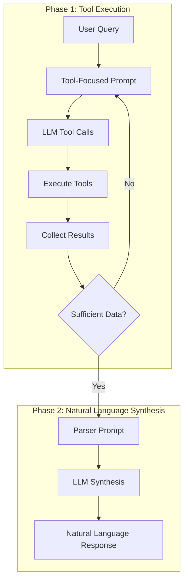

# LLM Agent Cognitive Processing System

This document deep-dives into the cognitive processing system - the core innovation that enables intelligent, multi-turn reasoning with reliable tool execution and natural language synthesis.

## 🧠 Cognitive Processing Overview

The cognitive processing system implements a two-phase approach that separates tool execution from natural language generation, resulting in more reliable and intelligent agent behavior.

### Two-Phase Architecture



## 🔄 Cognitive Processing Loop

### Main Loop Implementation

The `_cognitive_processing_loop` method orchestrates the entire cognitive process:

```python
async def _cognitive_processing_loop(self, user_input: str, conversation_id: str) -> str:
    """
    Multi-turn cognitive processing loop with parser prompt for final synthesis.
    Uses small model for tool execution, then parser prompt for natural language response.
    """
    max_iterations = 3  # Reduced iterations since we're using parser approach
    iteration = 0
    current_prompt = user_input
    all_tool_results = []
    
    logger.info(f"Starting cognitive processing with parser approach for: {user_input[:50]}...")
    
    # Phase 1: Tool execution with focused prompts
    while iteration < max_iterations:
        iteration += 1
        logger.info(f"Tool execution iteration {iteration}")
        
        # Ensure provider is ready
        provider = await self._ensure_provider()
        
        # Get available tools and build tool-focused system prompt
        ollama_tools = self._get_ollama_tools_schema()
        tool_focused_prompt = self._build_tool_focused_prompt(conversation_id)
        
        # Log orchestrator to model communication if enabled
        if self.log_everything:
            self.structured_logger.log_orchestrator_to_model(
                phase="PHASE 1 - TOOL EXECUTION",
                iteration=iteration,
                prompt=current_prompt,
                system_prompt=tool_focused_prompt,
                tools=ollama_tools
            )
        
        # Generate response with tools (focused on execution, not explanation)
        llm_response = await provider.generate(
            prompt=current_prompt,
            system_prompt=tool_focused_prompt,
            tools=ollama_tools if ollama_tools else None,
            max_tokens=provider.config.get("max_tokens", 1024),  # Reduced for tool calls
            temperature=0.01  # Very low for reliable tool execution
        )
        
        # Handle tool calls and collect results
        response_text = await self._handle_agentic_tool_calls(llm_response, conversation_id)
        
        # Extract and store tool results
        iteration_results = self._extract_tool_results(response_text)
        all_tool_results.extend(iteration_results)
        
        logger.info(f"Iteration {iteration}: executed {len(iteration_results)} tools")
        
        # Check if we have sufficient data to answer the question
        if self._has_sufficient_data(user_input, all_tool_results):
            logger.info("Sufficient data collected - proceeding to synthesis")
            break
        
        # Prepare next iteration if more tools needed
        if iteration < max_iterations:
            current_prompt = self._prepare_tool_continuation(response_text, user_input)
    
    # Phase 2: Parser prompt for natural language synthesis
    logger.info("Starting parser prompt synthesis")
    final_response = await self._synthesize_natural_language_response(
        user_input, all_tool_results, conversation_id
    )
    
    return final_response
```

### Key Design Decisions

1. **Limited Iterations**: Maximum 3 iterations to prevent infinite loops
2. **Low Temperature**: Temperature 0.01 for reliable tool execution
3. **Tool-Focused Prompts**: Separate prompts optimized for tool calling
4. **Data Sufficiency Check**: Intelligent detection of when enough data is gathered
5. **Parser Synthesis**: Dedicated phase for natural language generation

## 🛠️ Phase 1: Tool Execution

### Tool-Focused Prompt Building

The system builds specialized prompts optimized for tool execution:

```python
def _build_tool_focused_prompt(self, conversation_id: str) -> str:
    """Build a tool-focused system prompt for reliable tool execution."""
    # Get conversation context
    context_summary = self.tool_context_manager.get_context_for_llm(conversation_id)
    
    # Use external prompt if available, otherwise fallback to hardcoded
    if "tool_execution" in self.prompts:
        base_prompt = self.prompts["tool_execution"]
        # Add conversation context if available
        if context_summary:
            tool_focused_prompt = f"{base_prompt}\\n\\n## CONVERSATION CONTEXT:\\n{context_summary}"
        else:
            tool_focused_prompt = base_prompt
    else:
        # Fallback to generic prompt - should be configured via external prompts instead
        logger.warning("No tool_execution prompt configured - using generic fallback.")
        tool_focused_prompt = f"""You are a scientific data analysis agent.

## PRIMARY DIRECTIVE:
Execute tools efficiently to gather data. Do NOT provide explanations or natural language responses.
Your only job is to call the appropriate tools with correct parameters.

## TOOL EXECUTION RULES:
1. Call tools with minimal response text
2. Use exact file paths from previous tool results
3. Don't explain what you're doing - just execute tools
4. Don't provide analysis or conclusions - just gather data

{f"## CONVERSATION CONTEXT:\\\\n{context_summary}" if context_summary else ""}

Execute the necessary tools to answer the user's question, then stop."""
    
    return tool_focused_prompt
```

### Tool Result Extraction

The system extracts structured tool results from LLM responses:

```python
def _extract_tool_results(self, response_text: str) -> List[Dict[str, Any]]:
    """Extract tool results from the response text."""
    tool_results = []
    lines = response_text.split('\\n')
    
    current_tool = None
    current_result = []
    
    for line in lines:
        if line.startswith('**') and ' result:**' in line:
            # Save previous tool result if any
            if current_tool and current_result:
                tool_results.append({
                    'tool_name': current_tool,
                    'result': '\\n'.join(current_result).strip()
                })
            
            # Start new tool result
            current_tool = line.replace('**', '').replace(' result:', '').strip()
            current_result = []
        elif current_tool:
            # Accumulate result lines
            current_result.append(line)
    
    # Save last tool result
    if current_tool and current_result:
        tool_results.append({
            'tool_name': current_tool,
            'result': '\\n'.join(current_result).strip()
        })
    
    return tool_results
```

### Data Sufficiency Detection

The system uses intelligent heuristics to determine when enough data has been gathered:

```python
def _has_sufficient_data(self, user_input: str, tool_results: List[Dict[str, Any]]) -> bool:
    """Check if we have sufficient data to answer the user's question."""
    if not tool_results:
        return False
    
    # Basic heuristics for common question patterns
    user_lower = user_input.lower()
    
    # For variable listing questions
    if 'variables' in user_lower and 'what' in user_lower:
        return any('inspect_variables' in result['tool_name'] for result in tool_results)
    
    # For min/max questions
    if any(word in user_lower for word in ['min', 'max', 'minimum', 'maximum']):
        return any('get_min_max' in result['tool_name'] or 'inspect_variables' in result['tool_name'] 
                  for result in tool_results)
    
    # For comparison questions
    if any(word in user_lower for word in ['compare', 'comparison', 'vs', 'versus']):
        return len(tool_results) >= 2  # Need multiple data points
    
    # For temporal/time analysis
    if any(word in user_lower for word in ['time', 'temporal', 'dynamics', 'changes']):
        return any('read_bp5' in result['tool_name'] or 'physical_time' in result['result'] 
                  for result in tool_results)
    
    # For general analysis questions
    if any(word in user_lower for word in ['simulation', 'analysis', 'represents', 'findings']):
        return len(tool_results) >= 1 and any(len(result['result']) > 100 for result in tool_results)
    
    # Default: if we have any substantial data
    return len(tool_results) >= 1
```

### Tool Continuation Logic

When more data is needed, the system prepares continuation prompts:

```python
def _prepare_tool_continuation(self, response_text: str, original_question: str) -> str:
    """Prepare prompt for next tool execution iteration."""
    return f"""Continue gathering data for: {original_question}

Previous tools executed, now execute additional tools if needed to fully answer the question.
Focus only on tool execution, not explanations."""
```

## 📝 Phase 2: Natural Language Synthesis

### Parser Prompt System

The synthesis phase uses specialized "parser prompts" to convert tool results into natural language:

```python
async def _synthesize_natural_language_response(self, user_input: str, tool_results: List[Dict[str, Any]], conversation_id: str) -> str:
    """Use parser prompt to synthesize natural language response from tool results."""
    if not tool_results:
        return "I wasn't able to gather the necessary data to answer your question."
    
    # Build comprehensive data summary
    data_summary = self._build_data_summary(tool_results)
    
    # Create parser prompt for natural language synthesis
    if "parser_synthesis" in self.prompts:
        # Use external prompt with variable substitution
        parser_prompt = PromptLoader.format_prompt(
            self.prompts["parser_synthesis"],
            user_input=user_input,
            data_summary=data_summary
        )
    else:
        # Fallback to hardcoded prompt
        parser_prompt = f"""Based on the scientific data analysis results below, provide a direct, factual answer to the user's question.

## USER QUESTION:
{user_input}

## ANALYSIS RESULTS:
{data_summary}

## RESPONSE REQUIREMENTS:
1. Answer ONLY what the user asked - do not speculate or add interpretations
2. Use the exact data from the analysis results
3. Be factual and precise with numbers and measurements
4. Do NOT make assumptions about what kind of simulation this might be
5. Do NOT suggest causes, mechanisms, or scientific explanations not present in the data
6. If the data shows errors or missing values, acknowledge them honestly
7. Keep responses concise and directly relevant to the question

Provide a direct, factual response using only the information present in the analysis results."""
    
    # Use provider for synthesis with higher temperature for natural language
    provider = await self._ensure_provider()
    
    # Get system prompt for synthesis
    synthesis_system_prompt = self.prompts.get(
        "synthesis_system", 
        "You are a precise data reporter who provides factual answers based strictly on the provided analysis results."
    )
    
    # Generate synthesis with different parameters than tool execution
    synthesis_response = await provider.generate(
        prompt=parser_prompt,
        system_prompt=synthesis_system_prompt,
        max_tokens=provider.config.get("max_tokens", 1024),
        temperature=0.1  # Lower temperature for factual, precise responses
    )
    
    logger.info(f"Generated synthesis response: {len(synthesis_response.text)} characters")
    return synthesis_response.text
```

### Data Summary Building

The system creates comprehensive summaries of all tool results:

```python
def _build_data_summary(self, tool_results: List[Dict[str, Any]]) -> str:
    """Build a comprehensive summary of all tool results."""
    summary_parts = []
    
    for i, result in enumerate(tool_results, 1):
        tool_name = result['tool_name']
        result_data = result['result']
        
        summary_parts.append(f"### Tool {i}: {tool_name}")
        summary_parts.append(result_data)
        summary_parts.append("")  # Add spacing
    
    return "\\n".join(summary_parts)
```

## 📊 Structured Logging Integration

### Comprehensive Logging

The cognitive processing system includes detailed logging for debugging and analysis:

```python
# Log orchestrator to model communication if enabled
if self.log_everything:
    self.structured_logger.log_orchestrator_to_model(
        phase="PHASE 1 - TOOL EXECUTION",
        iteration=iteration,
        prompt=current_prompt,
        system_prompt=tool_focused_prompt,
        tools=ollama_tools
    )

# Log model response if enabled
if self.log_everything:
    tool_calls = llm_response.metadata.get("tool_calls", [])
    self.structured_logger.log_model_to_orchestrator(
        phase="PHASE 1 - TOOL EXECUTION",
        response_length=len(llm_response.text),
        tool_calls=tool_calls
    )

# Log Phase 2 with structured logging if enabled
if self.log_everything:
    self.structured_logger.log_orchestrator_to_model(
        phase="PHASE 2 - RESPONSE SYNTHESIS",
        iteration=1,
        prompt=parser_prompt,
        system_prompt=synthesis_system_prompt
    )

# Log synthesis completion if enabled
if self.log_everything:
    self.structured_logger.log_synthesis_complete(
        user_input=user_input,
        final_response=synthesis_response.text,
        tool_count=len(tool_results)
    )
```

## 🎯 Benefits of Two-Phase Design

### Reliability Benefits

1. **Tool Execution Reliability**: Low temperature and focused prompts ensure consistent tool calling
2. **Parameter Accuracy**: Specialized prompts reduce parameter hallucination
3. **Completion Detection**: Smart detection prevents infinite tool calling loops
4. **Error Isolation**: Tool execution errors don't affect language generation

### Quality Benefits

1. **Natural Language Quality**: Dedicated synthesis phase with optimized prompts
2. **Factual Accuracy**: Parser prompts enforce factual responses based on tool results
3. **Consistent Formatting**: Structured approach to response generation
4. **Domain Appropriateness**: External prompts allow domain-specific synthesis

### Performance Benefits

1. **Efficient Tool Usage**: Multiple tools called in single iteration when possible
2. **Reduced Token Usage**: Tool-focused prompts are more concise
3. **Faster Synthesis**: Single synthesis call instead of multiple language generation rounds
4. **Better Context Management**: Clear separation of tool results and conversation context

### Debugging Benefits

1. **Clear Phase Separation**: Easy to debug tool execution vs. language generation issues
2. **Structured Logging**: Detailed logs for each phase and iteration
3. **Tool Result Visibility**: Clear visibility into what data was gathered
4. **Prompt Inspection**: External prompts can be modified without code changes

This cognitive processing system represents a significant advancement over traditional single-phase LLM interactions, providing reliability, quality, and debuggability for complex agentic tasks.