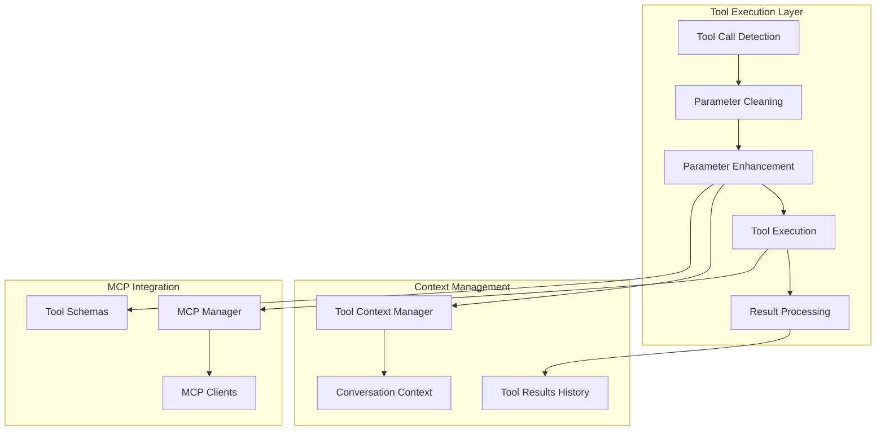

# LLM Agent Tool Handling System

This document details the sophisticated tool handling system that enables intelligent, context-aware tool calling with parameter enhancement and conversation continuity.

## 🛠️ Tool Handling Architecture

The tool handling system is built around the integration of MCP (Model Context Protocol) tools with intelligent parameter inference and conversation context management.

### Component Overview



## 🔧 Agentic Tool Call Handling

### Main Tool Call Handler

The `_handle_agentic_tool_calls` method orchestrates intelligent tool execution:

```python
async def _handle_agentic_tool_calls(self, llm_response: LLMResponse, conversation_id: str) -> str:
    """Handle tool calls with agentic intelligence and conversation context."""
    response_text = llm_response.text
    tool_calls = llm_response.metadata.get("tool_calls", [])
    
    if not tool_calls:
        return response_text
    
    logger.info(f"Processing {len(tool_calls)} agentic tool calls")
    
    # Execute each tool call with context-aware parameter enhancement
    tool_results = []
    for tool_call in tool_calls:
        try:
            function = tool_call.get("function", {})
            tool_name = function.get("name")
            raw_arguments = function.get("arguments", {})
            
            if tool_name:
                # Clean and type-convert arguments first
                cleaned_arguments = self._clean_tool_arguments(raw_arguments)
                
                # Enhance arguments using conversation context
                enhanced_arguments = self.tool_context_manager.suggest_parameters(
                    tool_name, conversation_id, cleaned_arguments
                )
                
                # Log parameter enhancement
                if enhanced_arguments != cleaned_arguments:
                    logger.info(f"🔧 Enhanced parameters for {tool_name}: {cleaned_arguments} -> {enhanced_arguments}")
                
                # Execute the tool call with timing
                start_time = datetime.now()
                result = await self.mcp_manager.call_tool(tool_name, enhanced_arguments)
                execution_time = (datetime.now() - start_time).total_seconds() * 1000
                
                # Create tool result object and add to conversation context
                tool_result = ToolResult(
                    tool_name=tool_name,
                    arguments=enhanced_arguments,
                    result=result,
                    timestamp=datetime.now(),
                    success='error' not in result or not result.get('isError', False),
                    error_message=None if 'error' not in result else str(result.get('error', 'Unknown error')),
                    execution_time_ms=execution_time
                )
                
                # Add to conversation context for future tool calls
                self.tool_context_manager.add_tool_result(conversation_id, tool_result)
                
                # Format the result for display
                formatted_result = self._format_tool_result(tool_name, result)
                tool_results.append(formatted_result)
                        
        except Exception as e:
            logger.error(f"Error executing agentic tool call {tool_name}: {e}")
            # Create failed tool result for context
            failed_result = ToolResult(
                tool_name=tool_name,
                arguments=raw_arguments,
                result={"error": str(e)},
                timestamp=datetime.now(),
                success=False,
                error_message=str(e)
            )
            self.tool_context_manager.add_tool_result(conversation_id, failed_result)
            tool_results.append(f"\\n**Error with {tool_name}:**\\n{str(e)}")
    
    # Combine response with tool results
    if tool_results:
        return response_text + "\\n" + "\\n".join(tool_results)
    else:
        return response_text
```

## 🧹 Parameter Cleaning and Type Conversion

### Argument Cleaning System

The system cleans and type-converts LLM-provided arguments to handle common string conversion issues:

```python
def _clean_tool_arguments(self, arguments: Dict[str, Any]) -> Dict[str, Any]:
    """Clean and type-convert tool arguments to handle LLM string conversions."""
    cleaned = {}
    
    for key, value in arguments.items():
        if isinstance(value, str):
            # Handle common string-to-type conversions
            if value == "None" or value == "null":
                # Convert string "None" to actual None
                cleaned[key] = None
            elif value.isdigit():
                # Convert numeric strings to integers
                cleaned[key] = int(value)
            elif self._is_float_string(value):
                # Convert float strings to floats
                cleaned[key] = float(value)
            elif value.lower() in ('true', 'false'):
                # Convert boolean strings to booleans
                cleaned[key] = value.lower() == 'true'
            else:
                # Keep as string
                cleaned[key] = value
        else:
            # Keep non-string values as-is
            cleaned[key] = value
    
    return cleaned

def _is_float_string(self, value: str) -> bool:
    """Check if a string represents a valid float."""
    try:
        float(value)
        return '.' in value  # Only consider it float if it has a decimal point
    except ValueError:
        return False
```

### Parameter Enhancement

The tool context manager enhances parameters based on conversation history:

```python
# In tool_context.py
def suggest_parameters(self, tool_name: str, conversation_id: str, 
                      user_provided_args: Dict[str, Any]) -> Dict[str, Any]:
    """Suggest intelligent parameters based on conversation context."""
    context = self.get_or_create_conversation(conversation_id)
    suggested_args = user_provided_args.copy()
    
    # Generic approach: use discovered files when filename is needed but not provided
    if "filename" in suggested_args and not suggested_args["filename"]:
        discovered_files = context.get_discovered_files()
        if discovered_files:
            # Use the first discovered file as default
            suggested_args["filename"] = discovered_files[0]
            logger.info(f"Suggested filename {discovered_files[0]} for {tool_name} from discovered files")
    
    # For tools requiring variable names, suggest from analyzed variables if available
    if "variable_name" in suggested_args and not suggested_args["variable_name"]:
        # Try to find variables from any analyzed file
        for filename, variables in context.analyzed_variables.items():
            if variables:
                var_names = list(variables.keys())
                if var_names:
                    suggested_args["variable_name"] = var_names[0]
                    logger.info(f"Suggested variable {var_names[0]} for {tool_name} from {filename}")
                    break
    
    return suggested_args
```

## 📊 Tool Result Management

### Tool Result Object

The system creates comprehensive tool result objects for context management:

```python
@dataclass
class ToolResult:
    """Represents the result of a tool execution."""
    tool_name: str
    arguments: Dict[str, Any]
    result: Any
    timestamp: datetime
    success: bool
    error_message: Optional[str] = None
    execution_time_ms: float = 0.0
    
    def to_dict(self) -> Dict[str, Any]:
        """Convert to dictionary for serialization."""
        return {
            "tool_name": self.tool_name,
            "arguments": self.arguments,
            "result": self.result,
            "timestamp": self.timestamp.isoformat(),
            "success": self.success,
            "error_message": self.error_message,
            "execution_time_ms": self.execution_time_ms
        }
```

### Result Formatting

Different MCP result formats are handled and formatted consistently:

```python
def _format_tool_result(self, tool_name: str, result: Any) -> str:
    """Format tool result for display."""
    if 'content' in result:
        # MCP standard format with content array
        formatted_parts = []
        for content_item in result['content']:
            if 'text' in content_item:
                formatted_parts.append(content_item['text'])
        return f"\\n**{tool_name} result:**\\n{''.join(formatted_parts)}"
    else:
        # Handle clean results (like from list_bp5)
        if isinstance(result, (list, dict)):
            formatted_result = json.dumps(result, indent=2)
        else:
            formatted_result = str(result)
        return f"\\n**{tool_name} result:**\\n{formatted_result}"
```

## 📈 Tool Execution Logging

### Comprehensive Tool Logging

The system provides detailed logging for tool execution with pretty formatting:

```python
def _log_tool_execution_start(self, tool_name: str, arguments: Dict[str, Any]) -> None:
    """Log tool execution start with pretty formatting."""
    args_str = json.dumps(arguments, indent=2) if arguments else "{}"
    logger.info(f"🔨 Executing tool: {tool_name}")
    logger.info(f"📋 Arguments:\\n{args_str}")

def _log_tool_execution_result(self, tool_name: str, result: Any, execution_time_ms: float) -> None:
    """Log tool execution result with pretty formatting."""
    # Determine success/failure
    success = not (isinstance(result, dict) and result.get('isError', False))
    status_emoji = "✅" if success else "❌"
    
    # Format result for logging
    if isinstance(result, dict):
        if 'content' in result:
            # MCP format result
            content_text = ""
            for content_item in result['content']:
                if 'text' in content_item:
                    content_text += content_item['text'][:200] + ("..." if len(content_item['text']) > 200 else "")
            result_preview = content_text
        elif result.get('isError', False):
            # Error result
            error_msg = result.get('error', 'Unknown error')
            result_preview = f"ERROR: {error_msg}"
        else:
            # Clean result (like from list_bp5)
            result_str = json.dumps(result, indent=2)
            result_preview = result_str[:200] + ("..." if len(result_str) > 200 else "")
    else:
        result_preview = str(result)[:200] + ("..." if len(str(result)) > 200 else "")
    
    logger.info(f"{status_emoji} Tool {tool_name} completed in {execution_time_ms:.1f}ms")
    logger.info(f"📤 Result preview: {result_preview}")
```

### Structured Logging Integration

When detailed logging is enabled, the system uses structured logging:

```python
# Log tool execution with structured logging if enabled
if self.log_everything:
    success = not (isinstance(result, dict) and result.get('isError', False))
    error_msg = None
    if not success and isinstance(result, dict):
        error_msg = result.get('error', 'Unknown error')
    
    # Format result preview
    if isinstance(result, dict) and 'content' in result:
        result_preview = ""
        for content_item in result['content']:
            if 'text' in content_item:
                result_preview += content_item['text']
    else:
        result_preview = str(result)
    
    self.structured_logger.log_tool_call(
        tool_name=tool_name,
        arguments=enhanced_arguments,
        execution_time_ms=execution_time,
        success=success,
        result_preview=result_preview,
        error_msg=error_msg
    )
```

## 🔗 Tool Schema Integration

### Schema Validation and Conversion

The system converts MCP tool schemas to different LLM provider formats:

```python
def _get_ollama_tools_schema(self) -> List[Dict[str, Any]]:
    """Convert MCP tools to Ollama tools schema."""
    ollama_tools = []
    
    for tool_name, client in self.mcp_manager.clients.items():
        for mcp_tool_name, tool_schema in client.tools.items():
            # Convert MCP tool schema to Ollama format
            ollama_tool = {
                "type": "function",
                "function": {
                    "name": mcp_tool_name,
                    "description": tool_schema.get("description", ""),
                    "parameters": {
                        "type": "object",
                        "properties": {},
                        "required": []
                    }
                }
            }
            
            # Use actual MCP tool input schema if available
            if "inputSchema" in tool_schema:
                input_schema = tool_schema["inputSchema"]
                if "properties" in input_schema:
                    ollama_tool["function"]["parameters"]["properties"] = input_schema["properties"]
                if "required" in input_schema:
                    ollama_tool["function"]["parameters"]["required"] = input_schema["required"]
            else:
                # No inputSchema available - fail fast instead of using fallbacks
                logger.error(f"Tool {mcp_tool_name} has no inputSchema - MCP server may be misconfigured")
                raise RuntimeError(f"Tool {mcp_tool_name} is missing required inputSchema.")
            
            ollama_tools.append(ollama_tool)
    
    return ollama_tools
```

### Fail-Fast Schema Handling

Instead of using hardcoded fallbacks, the system fails fast when tool schemas are incomplete:

```python
else:
    # No inputSchema available - this indicates a problem with the MCP server
    # Rather than hardcoding tool-specific fallbacks, we should fail gracefully
    logger.error(f"Tool {mcp_tool_name} has no inputSchema - MCP server may be misconfigured")
    raise RuntimeError(f"Tool {mcp_tool_name} is missing required inputSchema. This suggests the MCP server is not properly configured or the tool definition is incomplete.")
```

## 🎯 Tool Prerequisite Management

### Prerequisite Detection

The tool context manager can detect when prerequisite tools should be run first:

```python
def should_suggest_prerequisites(self, tool_name: str, conversation_id: str) -> List[str]:
    """Check if prerequisite tools should be run first."""
    context = self.get_or_create_conversation(conversation_id)
    prerequisites = self.tool_dependencies.get(tool_name, [])
    
    missing_prerequisites = []
    for prereq in prerequisites:
        if not context.has_successful_tool_result(prereq):
            missing_prerequisites.append(prereq)
    
    return missing_prerequisites
```

### Prerequisite Logging

When prerequisites are missing, the system logs warnings:

```python
# Check for missing prerequisites
missing_prereqs = self.tool_context_manager.should_suggest_prerequisites(tool_name, conversation_id)
if missing_prereqs:
    logger.info(f"⚠️  Tool {tool_name} has missing prerequisites: {missing_prereqs}")
    # For now, continue with the call - the LLM should handle prerequisites
```

## 🔄 Legacy Tool Call Support

### Backward Compatibility

The system also supports legacy text-based tool calling formats:

```python
async def _handle_tool_calls(self, response_text: str) -> str:
    """Parse and execute tool calls from LLM response."""
    if "TOOL_CALL:" not in response_text:
        return response_text
    
    lines = response_text.split('\\n')
    result_lines = []
    
    for line in lines:
        if line.strip().startswith("TOOL_CALL:"):
            try:
                # Parse tool call: tool_name(arg1=value1, arg2=value2)
                tool_call = line.strip()[10:].strip()  # Remove "TOOL_CALL:"
                
                if '(' in tool_call and ')' in tool_call:
                    tool_name = tool_call.split('(')[0].strip()
                    args_str = tool_call.split('(', 1)[1].rsplit(')', 1)[0]
                    
                    # Parse arguments
                    arguments = {}
                    if args_str.strip():
                        for arg in args_str.split(','):
                            if '=' in arg:
                                key, value = arg.split('=', 1)
                                key = key.strip()
                                value = value.strip().strip('"\\\'')
                                
                                # Try to convert to appropriate type
                                if value.isdigit():
                                    value = int(value)
                                elif value.replace('.', '').isdigit():
                                    value = float(value)
                                elif value.lower() in ('true', 'false'):
                                    value = value.lower() == 'true'
                                
                                arguments[key] = value
                    
                    # Execute tool
                    result = await self.mcp_manager.call_tool(tool_name, arguments)
                    
                    # Format result
                    result_lines.append(f"Tool result for {tool_name}:")
                    if 'content' in result:
                        for content_item in result['content']:
                            if 'text' in content_item:
                                result_lines.append(content_item['text'])
                    else:
                        result_lines.append(str(result))
                        
            except Exception as e:
                logger.error(f"Error executing tool call '{line}': {e}")
                result_lines.append(f"Tool execution error: {str(e)}")
        else:
            result_lines.append(line)
    
    return '\\n'.join(result_lines)
```

## 🎉 Benefits of the Tool Handling System

### Intelligence Benefits

1. **Parameter Inference**: Automatically suggests parameters based on conversation context
2. **Type Conversion**: Handles LLM string output conversion to proper types  
3. **Context Awareness**: Uses previous tool results to inform future tool calls
4. **Error Recovery**: Graceful handling of tool execution failures

### Reliability Benefits

1. **Schema Validation**: Ensures all tools have proper schemas before use
2. **Fail-Fast Errors**: Clear error messages when tools are misconfigured
3. **Result Validation**: Checks tool execution success and logs failures
4. **Connection Management**: Robust MCP server connection handling

### Observability Benefits

1. **Detailed Logging**: Comprehensive logs for debugging tool issues
2. **Execution Timing**: Performance monitoring for individual tool calls
3. **Parameter Tracking**: Visibility into parameter enhancement process
4. **Result Formatting**: Consistent display of different result formats

### Extensibility Benefits

1. **Generic Design**: Works with any MCP-compliant tool server
2. **Provider Agnostic**: Converts schemas for different LLM providers
3. **Context Rules**: Configurable rules for parameter inference
4. **Legacy Support**: Backward compatibility with text-based tool calls

This tool handling system provides the foundation for intelligent, reliable tool usage in agentic systems, with comprehensive error handling and observability.