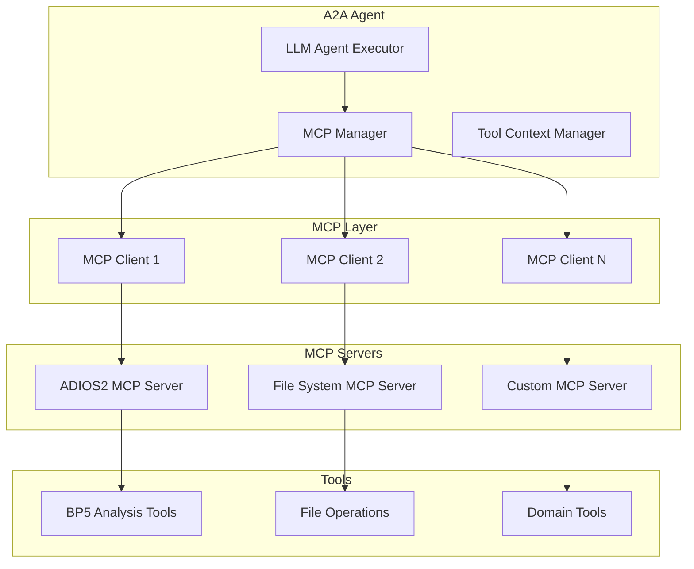

# MCP Integration System

This document provides a comprehensive guide to the Model Context Protocol (MCP) integration, including server setup, tool autodetection, schema handling, and building custom MCP servers.

## 🌐 MCP Overview

Model Context Protocol (MCP) is a standardized protocol for connecting LLMs to external tools and data sources. This project implements a robust MCP integration system that enables automatic tool discovery, intelligent parameter handling, and reliable tool execution.

### MCP Architecture



## 🔧 MCP Manager Implementation

### Core MCP Manager

The `MCPManager` class in `shared/mcp/manager.py` orchestrates all MCP connections:

```python
class MCPManager:
    """Manages MCP server connections and tool calling."""
    
    def __init__(self):
        self.clients: Dict[str, MCPClient] = {}
        self.connection_status: Dict[str, bool] = {}
    
    async def add_server(self, name: str, command: List[str], cwd: Optional[str] = None) -> bool:
        """Add and connect to an MCP server."""
        try:
            logger.info(f"Connecting to MCP server: {name}")
            
            client = MCPClient(command, cwd)
            success = await client.connect()
            
            if success:
                self.clients[name] = client
                self.connection_status[name] = True
                logger.info(f"Successfully connected to MCP server: {name}")
                
                # Log available tools
                tools = client.get_available_tools()
                for tool_name, description in tools.items():
                    logger.info(f"  📋 Tool: {tool_name} - {description}")
                
                return True
            else:
                logger.error(f"Failed to connect to MCP server: {name}")
                self.connection_status[name] = False
                return False
                
        except Exception as e:
            logger.error(f"Error connecting to MCP server {name}: {e}")
            self.connection_status[name] = False
            return False
    
    def get_server_tools(self, server_name: str) -> Dict[str, str]:
        """Get available tools from a specific server."""
        if server_name in self.clients:
            return self.clients[server_name].get_available_tools()
        return {}
    
    def get_all_tools(self) -> Dict[str, Dict[str, Any]]:
        """Get all available tools from all connected servers."""
        all_tools = {}
        for server_name, client in self.clients.items():
            server_tools = client.tools
            for tool_name, tool_schema in server_tools.items():
                all_tools[tool_name] = {
                    "server": server_name,
                    "schema": tool_schema,
                    "description": tool_schema.get("description", "")
                }
        return all_tools
    
    async def call_tool(self, tool_name: str, arguments: Dict[str, Any]) -> Dict[str, Any]:
        """Call a tool on the appropriate MCP server."""
        # Find which server has this tool
        for server_name, client in self.clients.items():
            if tool_name in client.tools:
                try:
                    logger.info(f"Calling tool {tool_name} on server {server_name}")
                    result = await client.call_tool(tool_name, arguments)
                    return result
                except Exception as e:
                    logger.error(f"Error calling tool {tool_name}: {e}")
                    return {
                        "isError": True,
                        "error": str(e),
                        "tool_name": tool_name,
                        "server": server_name
                    }
        
        # Tool not found
        available_tools = list(self.get_all_tools().keys())
        error_msg = f"Tool '{tool_name}' not found. Available tools: {available_tools}"
        logger.error(error_msg)
        return {
            "isError": True,
            "error": error_msg,
            "tool_name": tool_name
        }
    
    async def disconnect_all(self):
        """Disconnect from all MCP servers."""
        for name, client in self.clients.items():
            try:
                await client.disconnect()
                logger.info(f"Disconnected from MCP server: {name}")
            except Exception as e:
                logger.error(f"Error disconnecting from {name}: {e}")
        
        self.clients.clear()
        self.connection_status.clear()
```

## 🔌 MCP Client Implementation

### Client Communication

The `MCPClient` class in `shared/mcp/client.py` handles JSON-RPC communication with MCP servers:

```python
class MCPClient:
    """Client for communicating with MCP servers via subprocess."""
    
    def __init__(self, command: List[str], cwd: Optional[str] = None):
        self.command = command
        self.cwd = Path(cwd) if cwd else None
        self.process: Optional[subprocess.Popen] = None
        self.tools: Dict[str, Dict[str, Any]] = {}
        self.is_connected = False
    
    async def connect(self) -> bool:
        """Connect to the MCP server."""
        try:
            logger.info(f"Starting MCP server: {' '.join(self.command)}")
            
            # Start the MCP server process
            self.process = subprocess.Popen(
                self.command,
                stdin=subprocess.PIPE,
                stdout=subprocess.PIPE,
                stderr=subprocess.PIPE,
                text=True,
                cwd=self.cwd
            )
            
            # Initialize connection with correct MCP protocol
            init_response = await self._send_request({
                "jsonrpc": "2.0",
                "id": 1,
                "method": "initialize",
                "params": {
                    "protocolVersion": "2024-11-05",
                    "capabilities": {
                        "tools": {}
                    },
                    "clientInfo": {
                        "name": "A2A-CLI",
                        "version": "0.1.0"
                    }
                }
            })
            
            # Send initialized notification
            await self._send_notification({
                "jsonrpc": "2.0",
                "method": "notifications/initialized"
            })
            
            # List available tools
            await self._list_tools()
            
            self.is_connected = True
            logger.info(f"Connected to MCP server with {len(self.tools)} tools")
            return True
            
        except Exception as e:
            logger.error(f"Failed to connect to MCP server: {e}")
            await self.disconnect()
            return False
```

### Tool Discovery

The client automatically discovers available tools during connection:

```python
async def _list_tools(self):
    """List available tools from the MCP server."""
    try:
        response = await self._send_request({
            "jsonrpc": "2.0",
            "id": 2,
            "method": "tools/list",
            "params": {}
        })
        
        if "result" in response and "tools" in response["result"]:
            for tool in response["result"]["tools"]:
                self.tools[tool["name"]] = tool
                logger.debug(f"Available tool: {tool['name']} - {tool.get('description', 'No description')}")
        
    except Exception as e:
        logger.error(f"Failed to list tools: {e}")

def get_available_tools(self) -> Dict[str, str]:
    """Get a dictionary of available tools and their descriptions."""
    return {
        name: tool.get("description", "No description")
        for name, tool in self.tools.items()
    }

def get_tool_schema(self, tool_name: str) -> Optional[Dict[str, Any]]:
    """Get the schema for a specific tool."""
    return self.tools.get(tool_name)
```

### Tool Execution

The client executes tools via JSON-RPC:

```python
async def call_tool(self, tool_name: str, arguments: Dict[str, Any]) -> Dict[str, Any]:
    """Call a tool on the MCP server."""
    if not self.is_connected:
        raise RuntimeError("MCP server not connected")
    
    if tool_name not in self.tools:
        available_tools = list(self.tools.keys())
        raise ValueError(f"Tool '{tool_name}' not available. Available tools: {available_tools}")
    
    try:
        logger.info(f"Calling MCP tool: {tool_name} with args: {arguments}")
        
        response = await self._send_request({
            "jsonrpc": "2.0",
            "id": 3,
            "method": "tools/call",
            "params": {
                "name": tool_name,
                "arguments": arguments
            }
        })
        
        if "result" in response:
            return response["result"]
        else:
            raise RuntimeError(f"Unexpected response format: {response}")
            
    except Exception as e:
        logger.error(f"Error calling tool {tool_name}: {e}")
        raise
```

## 🔍 Tool Schema Autodetection

### Schema Validation

The system automatically validates tool schemas and fails fast if schemas are incomplete:

```python
def _get_ollama_tools_schema(self) -> List[Dict[str, Any]]:
    """Convert MCP tools to Ollama tools schema."""
    ollama_tools = []
    
    for tool_name, client in self.mcp_manager.clients.items():
        for mcp_tool_name, tool_schema in client.tools.items():
            # Convert MCP tool schema to Ollama format
            ollama_tool = {
                "type": "function",
                "function": {
                    "name": mcp_tool_name,
                    "description": tool_schema.get("description", ""),
                    "parameters": {
                        "type": "object",
                        "properties": {},
                        "required": []
                    }
                }
            }
            
            # Use actual MCP tool input schema if available
            if "inputSchema" in tool_schema:
                input_schema = tool_schema["inputSchema"]
                if "properties" in input_schema:
                    ollama_tool["function"]["parameters"]["properties"] = input_schema["properties"]
                if "required" in input_schema:
                    ollama_tool["function"]["parameters"]["required"] = input_schema["required"]
            else:
                # No inputSchema available - fail fast instead of using fallbacks
                logger.error(f"Tool {mcp_tool_name} has no inputSchema - MCP server may be misconfigured")
                raise RuntimeError(f"Tool {mcp_tool_name} is missing required inputSchema.")
            
            ollama_tools.append(ollama_tool)
    
    return ollama_tools
```

### Schema Format Conversion

The system converts MCP schemas to different LLM provider formats:

#### MCP Schema Example

```json
{
  "name": "inspect_variables",
  "description": "Inspect variables in a BP5 file",
  "inputSchema": {
    "type": "object",
    "properties": {
      "filename": {
        "type": "string",
        "description": "Path to the BP5 file"
      }
    },
    "required": ["filename"]
  }
}
```

#### Converted Ollama Schema

```json
{
  "type": "function",
  "function": {
    "name": "inspect_variables",
    "description": "Inspect variables in a BP5 file",
    "parameters": {
      "type": "object",
      "properties": {
        "filename": {
          "type": "string",
          "description": "Path to the BP5 file"
        }
      },
      "required": ["filename"]
    }
  }
}
```

## 🏗️ Building Custom MCP Servers

### MCP Server Structure

To build a custom MCP server, follow this structure:

```python
import asyncio
import json
import sys
from typing import Any, Dict, List

class CustomMCPServer:
    """Custom MCP server implementation."""
    
    def __init__(self):
        self.tools = {
            "my_tool": {
                "name": "my_tool",
                "description": "Description of my tool",
                "inputSchema": {
                    "type": "object",
                    "properties": {
                        "param1": {
                            "type": "string",
                            "description": "First parameter"
                        },
                        "param2": {
                            "type": "integer",
                            "description": "Second parameter"
                        }
                    },
                    "required": ["param1"]
                }
            }
        }
    
    async def handle_request(self, request: Dict[str, Any]) -> Dict[str, Any]:
        """Handle incoming JSON-RPC requests."""
        method = request.get("method")
        params = request.get("params", {})
        request_id = request.get("id")
        
        if method == "initialize":
            return {
                "jsonrpc": "2.0",
                "id": request_id,
                "result": {
                    "protocolVersion": "2024-11-05",
                    "capabilities": {
                        "tools": {"listChanged": True}
                    },
                    "serverInfo": {
                        "name": "custom-mcp-server",
                        "version": "1.0.0"
                    }
                }
            }
        
        elif method == "tools/list":
            return {
                "jsonrpc": "2.0",
                "id": request_id,
                "result": {
                    "tools": list(self.tools.values())
                }
            }
        
        elif method == "tools/call":
            tool_name = params.get("name")
            arguments = params.get("arguments", {})
            
            if tool_name in self.tools:
                result = await self.execute_tool(tool_name, arguments)
                return {
                    "jsonrpc": "2.0",
                    "id": request_id,
                    "result": result
                }
            else:
                return {
                    "jsonrpc": "2.0",
                    "id": request_id,
                    "error": {
                        "code": -32601,
                        "message": f"Tool not found: {tool_name}"
                    }
                }
        
        else:
            return {
                "jsonrpc": "2.0",
                "id": request_id,
                "error": {
                    "code": -32601,
                    "message": f"Method not found: {method}"
                }
            }
    
    async def execute_tool(self, tool_name: str, arguments: Dict[str, Any]) -> Dict[str, Any]:
        """Execute a specific tool."""
        if tool_name == "my_tool":
            # Implement your tool logic here
            param1 = arguments.get("param1")
            param2 = arguments.get("param2", 0)
            
            result = f"Processed {param1} with value {param2}"
            
            return {
                "content": [
                    {
                        "type": "text",
                        "text": result
                    }
                ]
            }
        
        raise ValueError(f"Unknown tool: {tool_name}")
    
    async def run(self):
        """Run the MCP server main loop."""
        while True:
            try:
                line = sys.stdin.readline()
                if not line:
                    break
                
                request = json.loads(line.strip())
                response = await self.handle_request(request)
                
                print(json.dumps(response))
                sys.stdout.flush()
                
            except json.JSONDecodeError:
                continue
            except Exception as e:
                error_response = {
                    "jsonrpc": "2.0",
                    "id": None,
                    "error": {
                        "code": -32603,
                        "message": f"Internal error: {str(e)}"
                    }
                }
                print(json.dumps(error_response))
                sys.stdout.flush()

if __name__ == "__main__":
    server = CustomMCPServer()
    asyncio.run(server.run())
```

### MCP Server Configuration

Add your custom MCP server to the configuration:

```yaml
mcp_servers:
  custom_server:
    name: "custom_server"
    command: ["python", "path/to/custom_mcp_server.py"]
    cwd: "."
    enabled: true
```

### Tool Schema Requirements

For proper integration, ensure your MCP tools have complete schemas:

```json
{
  "name": "tool_name",
  "description": "Clear description of what the tool does",
  "inputSchema": {
    "type": "object",
    "properties": {
      "param_name": {
        "type": "string|integer|boolean|array|object",
        "description": "Clear description of the parameter"
      }
    },
    "required": ["required_param_names"]
  }
}
```

## 🔧 MCP Configuration Management

### Server Configuration

MCP servers are configured in the main configuration file:

```yaml
mcp_servers:
  adios2:
    name: "adios2"
    command: ["uv", "--directory", "adios", "run", "adios-mcp"]
    cwd: "."
    enabled: true
  
  filesystem:
    name: "filesystem"
    command: ["python", "-m", "filesystem_mcp"]
    cwd: "/path/to/filesystem/tools"
    enabled: false
  
  custom:
    name: "custom"
    command: ["python", "custom_mcp_server.py"]
    cwd: "./custom_tools"
    enabled: true
```

### Dynamic Server Management

Servers can be enabled/disabled without code changes:

```python
async def _initialize_mcp_servers(self) -> None:
    """Initialize MCP servers from configuration."""
    if not self.config.mcp_servers:
        logger.info("No MCP servers configured")
        return
    
    logger.info(f"Initializing {len(self.config.mcp_servers)} MCP servers...")
    
    for server_name, server_config in self.config.mcp_servers.items():
        if not server_config.enabled:
            logger.info(f"Skipping disabled MCP server: {server_name}")
            continue
        
        try:
            success = await self.mcp_manager.add_server(
                server_name, 
                server_config.command, 
                server_config.cwd
            )
            
            if success:
                tools = self.mcp_manager.get_server_tools(server_name)
                logger.info(f"✅ MCP server '{server_name}' connected with {len(tools)} tools")
            else:
                logger.error(f"❌ Failed to connect to MCP server '{server_name}'")
                
        except Exception as e:
            logger.error(f"Error initializing MCP server '{server_name}': {e}")
```

## 📊 MCP Monitoring and Debugging

### Connection Status Monitoring

The system tracks MCP server connection status:

```python
def get_mcp_status(self) -> Dict[str, Any]:
    """Get status of all MCP servers."""
    status = {
        "total_servers": len(self.config.mcp_servers),
        "connected_servers": len([s for s in self.connection_status.values() if s]),
        "servers": {}
    }
    
    for server_name, is_connected in self.connection_status.items():
        server_status = {
            "connected": is_connected,
            "tools": []
        }
        
        if is_connected and server_name in self.clients:
            server_status["tools"] = list(self.clients[server_name].tools.keys())
        
        status["servers"][server_name] = server_status
    
    return status
```

### Tool Execution Logging

Comprehensive logging for MCP tool execution:

```python
async def call_tool(self, tool_name: str, arguments: Dict[str, Any]) -> Dict[str, Any]:
    """Call a tool on the appropriate MCP server."""
    # Find which server has this tool
    for server_name, client in self.clients.items():
        if tool_name in client.tools:
            try:
                logger.info(f"🔨 Calling tool {tool_name} on server {server_name}")
                logger.info(f"📋 Arguments: {json.dumps(arguments, indent=2)}")
                
                start_time = datetime.now()
                result = await client.call_tool(tool_name, arguments)
                execution_time = (datetime.now() - start_time).total_seconds() * 1000
                
                logger.info(f"✅ Tool {tool_name} completed in {execution_time:.1f}ms")
                return result
                
            except Exception as e:
                logger.error(f"❌ Error calling tool {tool_name}: {e}")
                return {
                    "isError": True,
                    "error": str(e),
                    "tool_name": tool_name,
                    "server": server_name
                }
```

## 🎯 Benefits of MCP Integration

### Standardization Benefits

1. **Protocol Compliance**: Uses standard MCP protocol for tool integration
2. **Interoperability**: Works with any MCP-compliant tool server
3. **Future-Proof**: Based on emerging industry standard
4. **Tool Discovery**: Automatic discovery of available tools

### Reliability Benefits

1. **Schema Validation**: Ensures all tools have proper parameter definitions
2. **Error Handling**: Comprehensive error handling and reporting
3. **Connection Management**: Robust connection handling with reconnection
4. **Fail-Fast Design**: Clear errors when tools are misconfigured

### Developer Experience Benefits

1. **Easy Integration**: Simple configuration to add new tool servers
2. **Debugging Support**: Comprehensive logging and status monitoring
3. **Schema Conversion**: Automatic conversion to different LLM provider formats
4. **Hot Reloading**: Can enable/disable servers without code changes

### Extensibility Benefits

1. **Domain Agnostic**: Works with tools from any domain
2. **Multiple Servers**: Support for multiple concurrent MCP servers
3. **Custom Tools**: Easy to build and integrate custom tool servers
4. **Provider Agnostic**: Converts schemas for different LLM providers

This MCP integration system provides a robust, standardized foundation for tool integration that can scale from simple single-tool servers to complex multi-domain tool ecosystems.