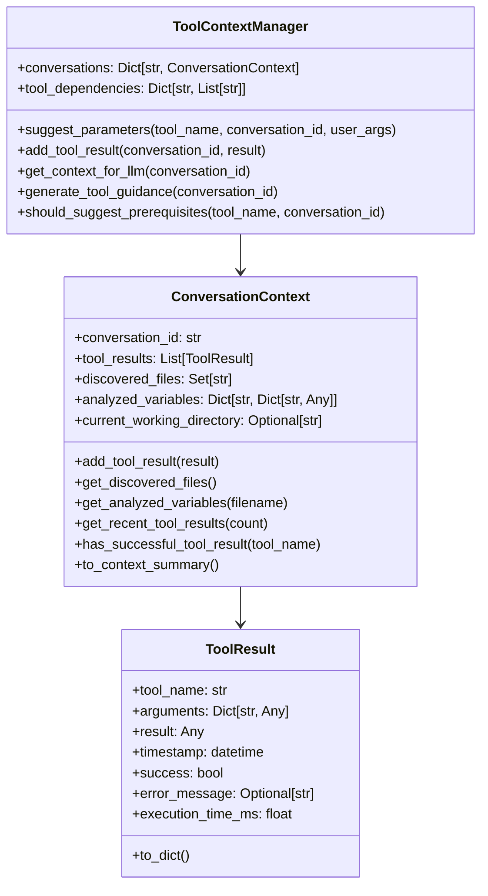

# Tool Context Management System

This document provides a comprehensive deep-dive into the Tool Context Management system - one of the most sophisticated and intelligent components that enables conversational continuity and intelligent tool parameter inference.

## 🧠 Tool Context Overview

The Tool Context Management system maintains conversation state, enables intelligent tool chaining, and provides context-aware parameter suggestions. It's implemented in `shared/core/tool_context.py` and is central to the agent's intelligence.

### Core Components



## 💾 ToolResult Data Structure

### Comprehensive Tool Result Tracking

Each tool execution creates a detailed `ToolResult` object:

```python
@dataclass
class ToolResult:
    """Represents the result of a tool execution."""
    tool_name: str
    arguments: Dict[str, Any]
    result: Any
    timestamp: datetime
    success: bool
    error_message: Optional[str] = None
    execution_time_ms: float = 0.0
    
    def to_dict(self) -> Dict[str, Any]:
        """Convert to dictionary for serialization."""
        return {
            "tool_name": self.tool_name,
            "arguments": self.arguments,
            "result": self.result,
            "timestamp": self.timestamp.isoformat(),
            "success": self.success,
            "error_message": self.error_message,
            "execution_time_ms": self.execution_time_ms
        }
```

### Benefits of Detailed Tracking

1. **Debugging**: Full visibility into tool execution history
2. **Performance Monitoring**: Execution time tracking for optimization
3. **Error Analysis**: Detailed error tracking for troubleshooting
4. **Context Building**: Rich data for intelligent parameter inference

## 🗂️ ConversationContext Management

### Context Data Structure

The `ConversationContext` maintains rich state for each conversation:

```python
@dataclass 
class ConversationContext:
    """Maintains context for a conversation including tool results."""
    conversation_id: str
    tool_results: List[ToolResult] = field(default_factory=list)
    discovered_files: Set[str] = field(default_factory=set)
    analyzed_variables: Dict[str, Dict[str, Any]] = field(default_factory=dict)
    current_working_directory: Optional[str] = None
```

### Context Extraction from Tool Results

The system intelligently extracts context information from tool results:

```python
def _extract_context_from_result(self, result: ToolResult) -> None:
    """Extract useful context information from tool results."""
    # Extract discovered files from file listing tools (generic approach)
    if result.tool_name.startswith(("list_", "discover_", "find_")) and result.success:
        if isinstance(result.result, list):
            for file_path in result.result:
                if isinstance(file_path, str):
                    self.discovered_files.add(file_path)
        elif isinstance(result.result, str):
            try:
                # Try to parse as JSON array
                files = json.loads(result.result)
                if isinstance(files, list):
                    self.discovered_files.update(str(f) for f in files)
            except json.JSONDecodeError:
                pass
                
    elif result.tool_name.startswith(("inspect_", "analyze_")) and result.success:
        # Extract variable information from inspection tools
        filename = result.arguments.get("filename", "unknown")
        if isinstance(result.result, dict):
            self.analyzed_variables[filename] = result.result
        elif isinstance(result.result, str):
            try:
                # Try to parse as JSON
                variables = json.loads(result.result)
                if isinstance(variables, dict):
                    self.analyzed_variables[filename] = variables
            except json.JSONDecodeError:
                pass
```

### Context Query Methods

The context provides various methods to query accumulated information:

```python
def get_discovered_files(self) -> List[str]:
    """Get list of discovered files from previous tool calls."""
    return sorted(list(self.discovered_files))

def get_analyzed_variables(self, filename: str) -> Optional[Dict[str, Any]]:
    """Get variable analysis for a specific file."""
    return self.analyzed_variables.get(filename)

def get_recent_tool_results(self, count: int = 5) -> List[ToolResult]:
    """Get the most recent tool results."""
    return self.tool_results[-count:] if self.tool_results else []

def get_tool_results_by_name(self, tool_name: str) -> List[ToolResult]:
    """Get all results for a specific tool."""
    return [r for r in self.tool_results if r.tool_name == tool_name]

def has_successful_tool_result(self, tool_name: str) -> bool:
    """Check if there's a successful result for a given tool."""
    return any(r.success for r in self.tool_results if r.tool_name == tool_name)
```

## 🎯 Intelligent Parameter Suggestion

### Context-Aware Parameter Enhancement

The core intelligence of the system lies in the `suggest_parameters` method:

```python
def suggest_parameters(self, tool_name: str, conversation_id: str, 
                      user_provided_args: Dict[str, Any]) -> Dict[str, Any]:
    """Suggest intelligent parameters based on conversation context."""
    context = self.get_or_create_conversation(conversation_id)
    suggested_args = user_provided_args.copy()
    
    # Generic approach: use discovered files when filename is needed but not provided
    if "filename" in suggested_args and not suggested_args["filename"]:
        discovered_files = context.get_discovered_files()
        if discovered_files:
            # Use the first discovered file as default
            suggested_args["filename"] = discovered_files[0]
            logger.info(f"Suggested filename {discovered_files[0]} for {tool_name} from discovered files")
    
    # For tools requiring variable names, suggest from analyzed variables if available
    if "variable_name" in suggested_args and not suggested_args["variable_name"]:
        # Try to find variables from any analyzed file
        for filename, variables in context.analyzed_variables.items():
            if variables:
                var_names = list(variables.keys())
                if var_names:
                    suggested_args["variable_name"] = var_names[0]
                    logger.info(f"Suggested variable {var_names[0]} for {tool_name} from {filename}")
                    break
    
    return suggested_args
```

### Parameter Suggestion Strategies

1. **File Discovery**: Uses previously discovered files when filenames are needed
2. **Variable Inference**: Suggests variable names from previously analyzed data
3. **Path Completion**: Uses context to complete partial file paths
4. **Default Values**: Provides intelligent defaults based on conversation history

### Domain-Agnostic Design

The parameter suggestion system is designed to be domain-agnostic:

- **Generic Tool Patterns**: Uses tool name prefixes (`list_`, `inspect_`, etc.) instead of hardcoded names
- **Flexible Context**: Extracts context from any tool that follows standard patterns
- **Configurable Rules**: Parameter suggestion rules can be extended without code changes

## 🔗 Tool Dependency Management

### Prerequisite Detection

The system can detect when prerequisite tools should be run first:

```python
def should_suggest_prerequisites(self, tool_name: str, conversation_id: str) -> List[str]:
    """Check if prerequisite tools should be run first."""
    context = self.get_or_create_conversation(conversation_id)
    prerequisites = self.tool_dependencies.get(tool_name, [])
    
    missing_prerequisites = []
    for prereq in prerequisites:
        if not context.has_successful_tool_result(prereq):
            missing_prerequisites.append(prereq)
    
    return missing_prerequisites
```

### Tool Dependency Configuration

Tool dependencies are configured in the context manager initialization:

```python
def __init__(self):
    self.conversations: Dict[str, ConversationContext] = {}
    # Generic tool dependencies - tools that need files should depend on file discovery tools
    self.tool_dependencies = {}
```

Note: The current implementation keeps dependencies empty to maintain domain-agnostic design. Dependencies can be configured externally if needed.

## 🧭 Tool Guidance Generation

### Dynamic Guidance System

The context manager generates intelligent guidance for the LLM based on conversation state:

```python
def generate_tool_guidance(self, conversation_id: str) -> str:
    """Generate guidance for the LLM about available context and next steps."""
    context = self.get_or_create_conversation(conversation_id)
    guidance = []
    
    if not context.tool_results:
        guidance.append("Start by discovering available files using file discovery tools.")
    
    if context.discovered_files and not context.analyzed_variables:
        files = context.get_discovered_files()
        guidance.append(f"Files discovered: {files[:3]}. Next, analyze variables or metadata using inspection tools.")
    
    if context.analyzed_variables:
        guidance.append("Variables analyzed. You can now perform detailed analysis, get statistics, or read specific data.")
    
    return " ".join(guidance) if guidance else ""
```

### Guidance Evolution

The guidance system evolves recommendations based on conversation progress:

1. **Initial State**: Suggests file discovery tools
2. **Files Discovered**: Recommends variable inspection
3. **Variables Known**: Suggests analysis and statistical operations
4. **Analysis Complete**: Recommends synthesis and interpretation

## 📝 Context Summarization for LLM

### LLM-Friendly Context Summary

The system generates concise context summaries for LLM consumption:

```python
def to_context_summary(self) -> str:
    """Generate a summary of the conversation context for the LLM."""
    summary = []
    
    if self.discovered_files:
        summary.append(f"Discovered files: {', '.join(list(self.discovered_files)[:10])}")
        if len(self.discovered_files) > 10:
            summary.append(f"... and {len(self.discovered_files) - 10} more files")
    
    if self.analyzed_variables:
        summary.append(f"Analyzed variables in {len(self.analyzed_variables)} files")
        for filename, variables in list(self.analyzed_variables.items())[:3]:
            var_names = list(variables.keys())[:5]
            summary.append(f"  {filename}: {', '.join(var_names)}")
    
    if self.tool_results:
        recent_tools = [r.tool_name for r in self.get_recent_tool_results(3)]
        summary.append(f"Recent tools used: {', '.join(recent_tools)}")
    
    return "\\n".join(summary) if summary else "No previous context available."
```

### Context Integration in Prompts

The context summary is integrated into LLM prompts:

```python
def get_context_for_llm(self, conversation_id: str) -> str:
    """Get context summary for LLM prompting."""
    context = self.get_or_create_conversation(conversation_id)
    return context.to_context_summary()
```

## 🔄 Conversation Lifecycle Management

### Conversation Creation and Management

The context manager handles conversation lifecycle:

```python
def get_or_create_conversation(self, conversation_id: str) -> ConversationContext:
    """Get or create a conversation context."""
    if conversation_id not in self.conversations:
        self.conversations[conversation_id] = ConversationContext(conversation_id)
        logger.info(f"Created new conversation context: {conversation_id}")
    return self.conversations[conversation_id]

def add_tool_result(self, conversation_id: str, result: ToolResult) -> None:
    """Add a tool result to the conversation context."""
    context = self.get_or_create_conversation(conversation_id)
    context.add_tool_result(result)
```

### Memory Management

The system maintains conversation contexts in memory with these characteristics:

1. **Per-Conversation Isolation**: Each conversation has separate context
2. **Incremental Building**: Context builds up over multiple tool calls
3. **Rich State**: Maintains files, variables, and tool history
4. **Efficient Queries**: Fast access to context information

## 🎯 Advanced Context Features

### Tool Result Analysis

The system analyzes tool results to extract structured information:

```python
def add_tool_result(self, result: ToolResult) -> None:
    """Add a tool result to the conversation context."""
    self.tool_results.append(result)
    self._extract_context_from_result(result)
    
    logger.info(f"Added tool result for {result.tool_name} to conversation {self.conversation_id}")
```

### Pattern-Based Extraction

Context extraction uses pattern-based recognition:

- **File Discovery Tools**: Any tool starting with `list_`, `discover_`, `find_`
- **Analysis Tools**: Any tool starting with `inspect_`, `analyze_`
- **Result Formats**: Handles both structured JSON and raw text results

### Flexible Data Storage

The context system stores various types of information:

```python
# Files discovered by any file listing tool
discovered_files: Set[str] = field(default_factory=set)

# Variables analyzed, organized by filename
analyzed_variables: Dict[str, Dict[str, Any]] = field(default_factory=dict)

# Current working directory context
current_working_directory: Optional[str] = None
```

## 🚀 Performance Optimizations

### Efficient Data Structures

1. **Sets for Files**: O(1) lookup for discovered files
2. **Dictionaries for Variables**: Fast access to variable data by filename
3. **List Slicing**: Efficient recent tool result retrieval
4. **Lazy Evaluation**: Context summaries generated on demand

### Memory Efficiency

1. **Conversation Isolation**: Each conversation maintains separate state
2. **Result Pruning**: Could implement automatic pruning of old results
3. **Context Compression**: Summarization reduces memory footprint
4. **Structured Storage**: Organized data prevents duplication

## 🎉 Benefits of Tool Context System

### Intelligence Benefits

1. **Parameter Inference**: Automatically suggests relevant parameters
2. **Context Continuity**: Maintains conversation state across interactions
3. **Tool Chaining**: Enables intelligent tool sequencing
4. **Adaptive Guidance**: Provides contextual recommendations

### Reliability Benefits

1. **Error Recovery**: Tracks failed tool calls for retry logic
2. **State Validation**: Ensures context consistency
3. **Prerequisite Detection**: Prevents tool calls with missing dependencies
4. **Result Validation**: Tracks tool execution success

### User Experience Benefits

1. **Reduced Friction**: Users don't need to repeat file paths or variable names
2. **Intelligent Defaults**: System suggests relevant parameters
3. **Conversation Flow**: Natural progression through analysis tasks
4. **Context Awareness**: Agent remembers previous work

### Developer Benefits

1. **Domain Agnostic**: Works with any tool set following conventions
2. **Extensible**: Easy to add new context extraction rules
3. **Observable**: Rich logging and debugging information
4. **Testable**: Clear separation of concerns for unit testing

This Tool Context Management system is a key differentiator that enables truly intelligent agentic behavior, allowing the agent to learn from each interaction and provide increasingly relevant suggestions as conversations progress.